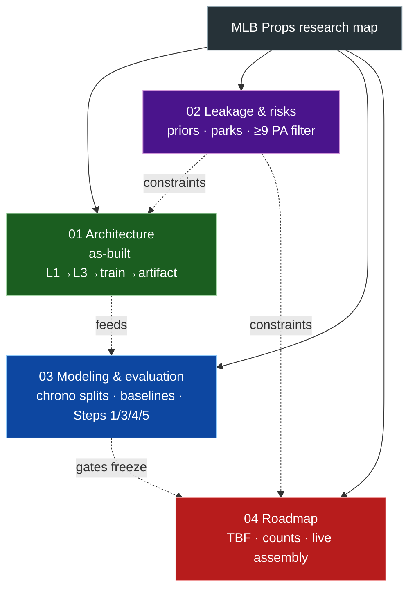

# Index — MLB Props research map

Four separate phase diagrams. Open each file for detail; this index only shows
how they relate.

**Status snapshot (2026-07):**

- Rate model path is built (248-feature LightGBM gate).
- Live lineup **ingestion** is partial; **prediction assembly** is missing.
- Projected TBF, count-probability layer, and Step 5 PA-weighting are missing.
- Step 7 registry freeze is blocked on Steps 1 / 3 / 4 / 5.
