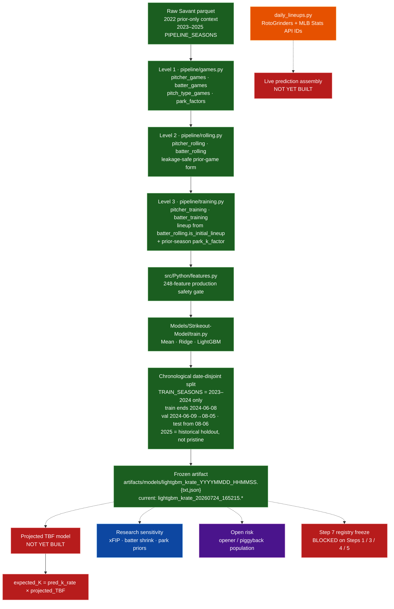

# 01 — Architecture (as-built)

Production research path for pregame pitcher `k_rate = K / PA`. Live inference
is a side branch and does **not** feed Level 3 historical training.

## Notes

- Historical opposing lineup uses `is_initial_lineup` (first nine distinct
  batters by first PA), not `daily_lineups.py`.
- Level 1 retains workload foundations (`Pitches`, `PA`, `Outs`). Level 2 keeps
  same-game `PA` / `Outs` / `K` / `k_rate` as **labels only** and drops
  `Pitches`. Lagged workload features (`PA_P*`, `Outs_P*`, `Pitches_P*`) are
  **not** produced yet — required before a TBF spine.
- `PROJECTION_SEASON = 2026` exists in config for forward park/projection work.
