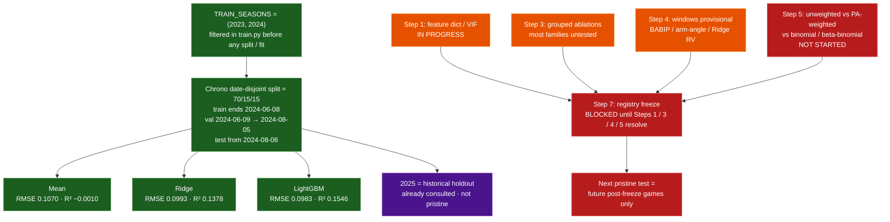

# 03 — Modeling and evaluation status

Chronological evaluation of the strikeout-rate model, plus research-step gates
before registry freeze.

## Notes

- Nested selection/confirmation folds live in
  `Models/Strikeout-Model/Strikeout-EDA/nested_cv.py`
  (`nested_research_folds`).
- Current `train.py` fits **unweighted** game-level `k_rate`. `PA` is retained
  as a label and can become `sample_weight` without a Level 1/2 rebuild.
- Older overlapping-date / 2025-consulting baselines are archived under
  `docs/archive/leaky-baseline-2026-07-23/`.
