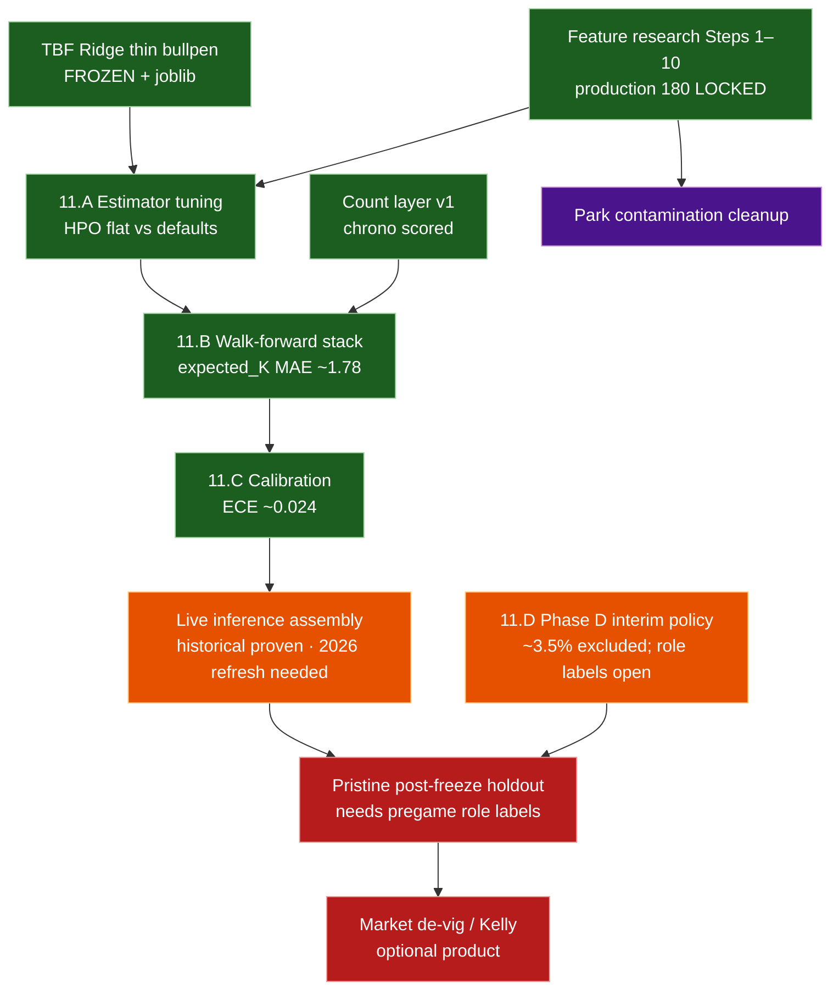

# 04 — Roadmap (decision-quality → live → market)

Research spine is **feature-frozen**. Phase 11.A–C was a **verification** pass
(small/no lifts). Phase D interim policy is frozen. Dashed edges = not done.

## Status (2026-07-28)

| Track | State |
|---|---|
| Feature research (Steps 1–10) | **Done** — `production` **180** |
| TBF + count layer v1 | **Done** |
| Phase 11.A–C model quality | **Done** — confirmatory |
| Phase D opener/piggyback | **Interim policy** — role labels still open |
| Live assembly | **v1 wired** — historical score works; need 2026 Level 1–2 refresh for true live |
| Market / Kelly | **Not started** |
| Pristine future holdout | **Blocked** on role labels |

## Why Phase 11 felt quiet

Gates exist to catch failure modes. Here the frozen defaults already sat near a
local optimum: nested HPO did not beat them; the stack held under walk-forward;
calibration did not need a patch. That is the intended outcome of a healthy
freeze — boring confirmation, not a new research story.

Canonical: `docs/phase11_model_quality_gates.md`,
`docs/phase_d_population_findings.md`, `docs/live_assembly_plan.md`.

## Workload companions

| Phase | Status |
|---|---|
| A–C rest / volume / thin bullpen | **Done** (in TBF) |
| D opener/piggyback | **Interim policy** — `docs/phase_d_population_findings.md` |

## Later (not critical path)

1. Refresh Savant → Level 1–2 through yesterday (unlocks true live).
2. Pregame role ingestion (opener / piggyback) for pristine v1.
3. Doubleheader-safe schedule join in `daily_lineups`.
4. Closing-line backtest + fractional Kelly.
5. NB / mixture-over-TBF challengers; park factor hygiene.
