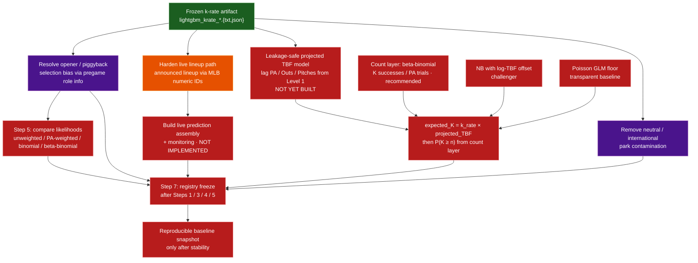

# 04 — Roadmap (remaining work)

Future layers after the frozen k-rate artifact. Dashed edges = not implemented.

## TBF spine (minimal, no Level 1 rebuild)

1. Read `pitcher_games.parquet` (already has `Pitches`, `PA`, `Outs`).
2. Add lagged workload features (`PA_P*`, `Outs_P*`, `Pitches_P*`) via rolling
   means — Level 2 does **not** emit these today.
3. Join onto existing `pitcher_training.parquet` on `(game_pk, pitcher)`.
4. Target = same-game `PA`; never use same-game `PA`/`Outs`/`Pitches` as features.
5. End-to-end props must score with **projected** TBF only.

## Live assembly (minimal)

1. Load frozen LightGBM `.txt` + feature list from `.json`.
2. Pull today's slate via `daily_lineups.build_daily_slate`.
3. As-of join pitcher form + announced opponent lineup + park factor.
4. Predict `k_rate`; write dated prediction parquet.
5. Block `expected_K` until the TBF model exists.
