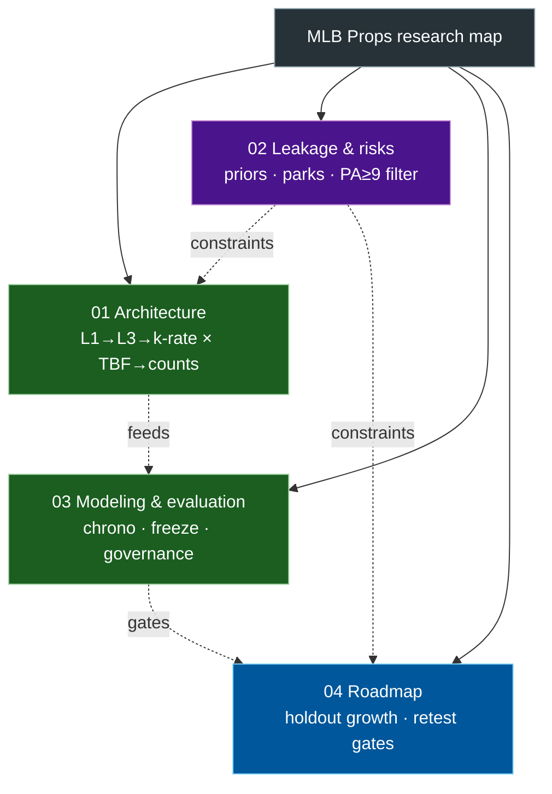

# Index — MLB Props research map

Four phase diagrams. Open each file for detail; this index only shows how they
relate.

> Live ops / approvals / deferred work: [`docs/EXECUTION_BACKLOG.md`](../EXECUTION_BACKLOG.md).
> This index is a research-status map, not the work queue.

**Status snapshot (2026-08-21):**

- **Feature spine locked:** LightGBM `production` **184** (Step 11 discipline
  lift on Step 10 P1) ×
  Ridge thin-bullpen TBF × count layer v1 (`p_over` lines **2.5…9.5**).
- **Phase 11.A–C done** (verification: HPO flat, WF expected_K ≈ 1.78, ECE ≈
  0.024) — `docs/research/phase11_model_quality_gates.md`.
- **Post-hoc isotonic `p_over_*` calibration** promoted in production pointer
  (`docs/research/prob_calibration_findings.md`); raw probabilities retained.
- **Phase D interim policy frozen** (~3.5% excluded by `PA≥9`) —
  `docs/research/phase_d_population_findings.md`. Pregame role labels still open for
  pristine v1.
- **Live + paper trading shipped:** morning log/grade → SharpAPI `odds_board` →
  `poll_odds open` (board-derived with `--from-recommendations`) → tip-window
  `close_watcher` → settle/CLV skill tracker — `production/README.md`,
  `docs/reference/market_clv_gates.md`.
- **CLV skill suite shipped (2026-08-06):** `production/notebooks/results_dashboard.ipynb`
  §11-20: reliability+z-test / residual decomposition / chrono recalibration /
  model health scorecard / BCa-CLV checkpoint framework — see
  `docs/research/notebook_change_log.md`. Floor + Kelly frozen at
  **12% / ⅛ Kelly** (`docs/research/floor_freeze_log.md`).
- **Execution vs research gate split wired:** execution lane tracks freshness,
  quote coverage, and board↔ledger parity; research lane tracks counterfactual
  confidence and long-horizon skill.
- **Focused monitoring split shipped:** KPI monitor / calibration lab / gate
  policy simulator view / PnL+CLV monitor now complement the deep-dive dashboard
  (`production/notebooks/results_*.ipynb`, `production/ops/policy_simulator.py`).
- **Exit-anomaly governance shipped:** source-tagged override table, training
  mask, confidence-aware rolling contamination policy, and WF A/B+sensitivity
  runners. Current 2023-2024 historical tag density is low, so aggregate WF
  deltas are neutral so far.
- **Next:** grow post-freeze holdout and monitor CI tightening; rerun
  challenger/promotion cycles only after explicit re-test criteria are met.
- **Deferred (not critical path):** Marcel age curve, Steamer/ZiPS/PECOTA floors,
  NB/mixture count challengers — see `docs/diagrams/04-roadmap.md` § Later.
- **Lineup:** training uses first-9-by-PA proxy; live uses announced RG order;
  ID resolve `active → 40Man → fullSeason` — `docs/reference/lineup_train_serve.md`.
- Do not reuse scored 2025 for selection or “final” metrics.
