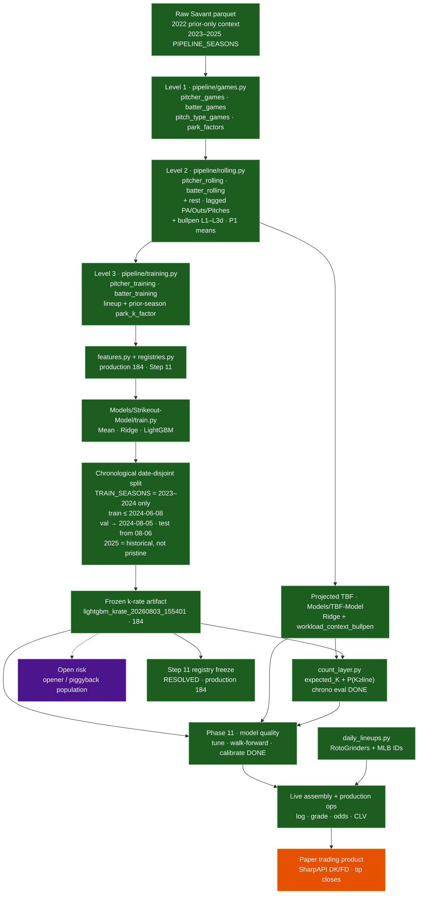

# 01 — Architecture (as-built)

Production research path for pregame pitcher `k_rate = K / PA`, plus the frozen
TBF → count-layer spine. Live scoring + paper trading are a **side branch** and
do **not** feed Level 3 historical training.

## Notes

- Historical opposing lineup uses `is_initial_lineup` (first nine distinct
  batters by first PA), not `daily_lineups.py`.
- Level 1 retains workload foundations (`Pitches`, `PA`, `Outs`). Level 2 emits
  lagged `PA_P*` / `Outs_P*` / `Pitches_P*`, rest flags, bullpen lookbacks, and
  mean windows including **P1** for physics stems used in Step 10.
- Workload / rest / bullpen columns are **experimental** for the k-rate gate;
  frozen LightGBM production does not consume them (they feed TBF).
- Companion feature set `step7_185` retains the pre-P1 freeze for bake-offs.
- Phase 11 gates: `docs/research/phase11_model_quality_gates.md` (done).
- Live ops: `production/README.md`; market protocol: `docs/reference/market_clv_gates.md`.
- `PROJECTION_SEASON = 2026` exists in config for forward park/projection work.
