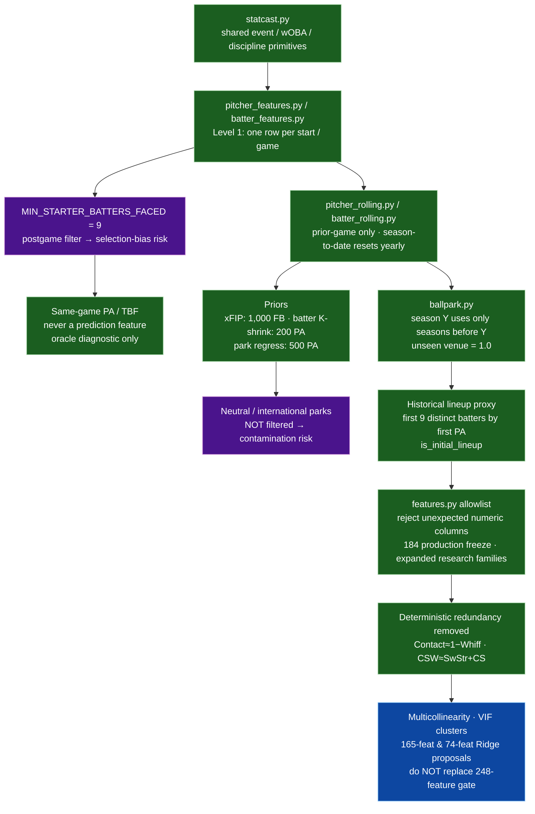

# 02 — Leakage and population risks

Horizontal constraints that apply to every pipeline level and future model.

## Hard rules

- Every feature must be known before first pitch.
- Forbidden as features: same-game `K`, `PA`, `Outs`, `k_rate`, actual TBF;
  future dates/seasons/lineups/park outcomes; IDs / names / team strings /
  raw dates / join keys.
- No SHAP on the current path (archived pre-pipeline SHAP used forbidden
  same-game fields). Prefer grouped permutation / drop-column importance.
- Live announced lineups (`daily_lineups.py`) replace the historical proxy at
  inference time only — never during Level 3 training construction.
- Gate changes are policy-controlled (`production/ops/kpi_policy.json`) and
  validated through scenario sweeps (`production/ops/policy_simulator.py`) plus
  focused monitor notebooks under `production/notebooks/`.
