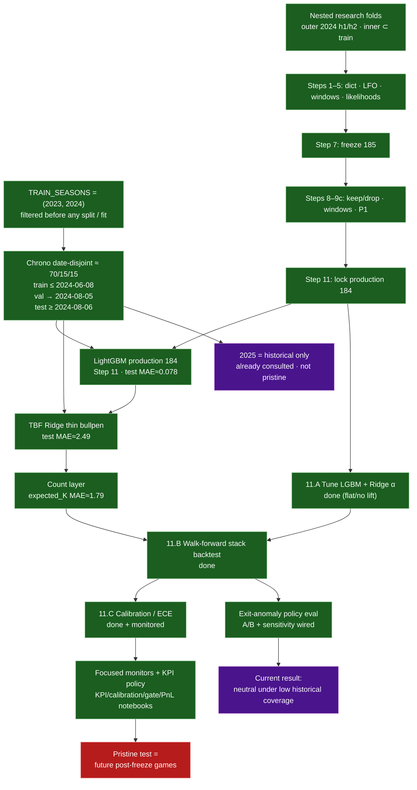

# 03 — Modeling and evaluation status

Chronological evaluation of the strikeout-rate model, frozen feature gates,
and the shipped model-quality + calibration governance loop.

## Notes

- Nested folds: `models/Strikeout-Model/research/nested_cv.py`.
- Production chrono split: `Python.training.chronological_split`.
- Keep **unweighted** LightGBM (`--sample-weight none`); PA-weight is diagnostic.
- Count metrics: prefer **Brier / log loss** over accuracy
  (`Python.count_layer.line_market_metrics`).
- Phase 11 plan: `docs/research/phase11_model_quality_gates.md`.
- Anomaly model-quality runners:
  `scripts/run_walkforward_anomaly_ab.py`,
  `scripts/run_walkforward_anomaly_sensitivity.py`.
- Focused ops loop: `production/notebooks/results_kpi_monitor.ipynb`,
  `results_calibration_lab.ipynb`, `results_gate_policy.ipynb`,
  `results_pnl_clv.ipynb`, plus `production/ops/policy_simulator.py`.
- Freeze record: `docs/research/step10_p1_registry_freeze.md`.
- Archived leaky baselines: `docs/archive/leaky-baseline-2026-07-23/`.
