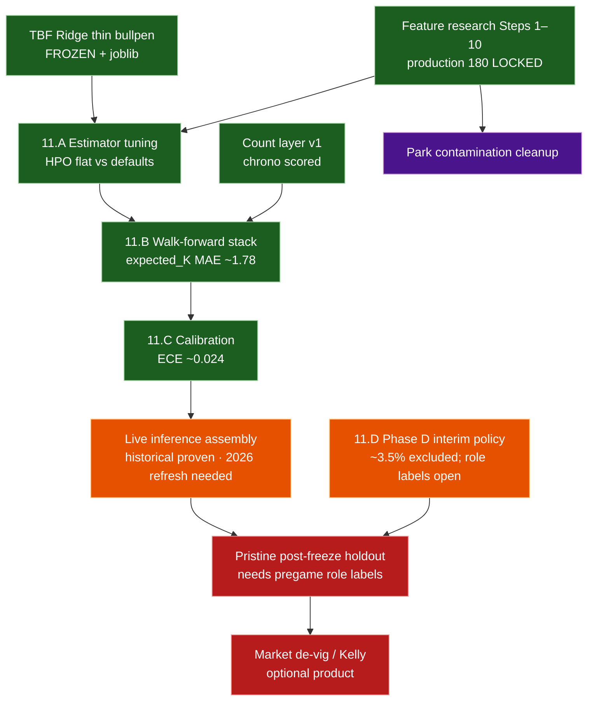

# 04 — Roadmap (decision-quality → live → market)

Research spine is **feature-frozen**. Phase 11.A–C was a **verification** pass
(small/no lifts). Phase D interim policy is frozen. Dashed edges = not done.

## Status (2026-07-28)

| Track | State |
|---|---|
| Feature research (Steps 1–10) | **Done** — `production` **180** |
| TBF + count layer v1 | **Done** |
| Phase 11.A–C model quality | **Done** — confirmatory |
| Phase D opener/piggyback | **Interim policy** — role labels still open |
| Live assembly | **v1 wired** — historical score works; need 2026 Level 1–2 refresh for true live |
| Market / Kelly | **Not started** |
| Pristine future holdout | **Protocol live** — `production/post_freeze_holdout.py` (`docs/reference/post_freeze_holdout.md`); grows with `game_date >= 2026-07-28` |
| Lineup train/serve | **Documented** — `docs/reference/lineup_train_serve.md` (historical first-9-by-PA vs live announced) |

## Why Phase 11 felt quiet

Gates exist to catch failure modes. Here the frozen defaults already sat near a
local optimum: nested HPO did not beat them; the stack held under walk-forward;
calibration did not need a patch. That is the intended outcome of a healthy
freeze — boring confirmation, not a new research story.

Canonical: `docs/research/phase11_model_quality_gates.md`,
`docs/research/phase_d_population_findings.md`, `docs/reference/live_assembly_plan.md`.

## Workload companions

| Phase | Status |
|---|---|
| A–C rest / volume / thin bullpen | **Done** (in TBF) |
| D opener/piggyback | **Interim policy** — `docs/research/phase_d_population_findings.md` |

## Later (not critical path)

### Ops / live

1. Refresh Savant → Level 1–2 through yesterday (unlocks true live).
2. Pregame role ingestion (opener / piggyback) for pristine v1.
3. Doubleheader-safe schedule join in `daily_lineups`.
4. Park-factor hygiene (neutral-site / international venue keys).

### Model / count-layer challengers

5. Closing-line backtest + fractional Kelly (product layer; needs lines history).
6. Negative-binomial / mixture-over-TBF challengers (count layer, not rate features).

### Deferred external baselines & enrichment (post–Marcel-lite)

Landed already: Marcel-lite krate floor
(`models/Strikeout-Model/research/marcel_baseline.py`, manuscript Table 3b).
These are **optional** follow-ons if the goal shifts from “leakage-safe stack”
to “best available predictor / market check”:

| Idea | Why later | Notes / blockers |
|---|---|---|
| **Age curve on Marcel** | Small expected lift; cleans the talent baseline | Needs birthdates (not in `player_id_map`); pybaseball / Chadwick register |
| **Steamer / ZiPS / PECOTA as game k_rate floors** | Richer season systems than Marcel | Licensing / scrape ethics; usually season rates → map to game rows; still not matchup models |
| **Sportsbook closing lines** | Only way to claim practical edge | Needs historical K-prop closes + de-vig; separate from modeling paper |
| **Weather / travel / catcher / umpire** | Possible rate or TBF signal | New leakage-safe joins; promote only via nested chrono screens |

Do **not** reopen the frozen 180-feature LightGBM set for these without a new
nested outer protocol and a pristine post-freeze holdout.
