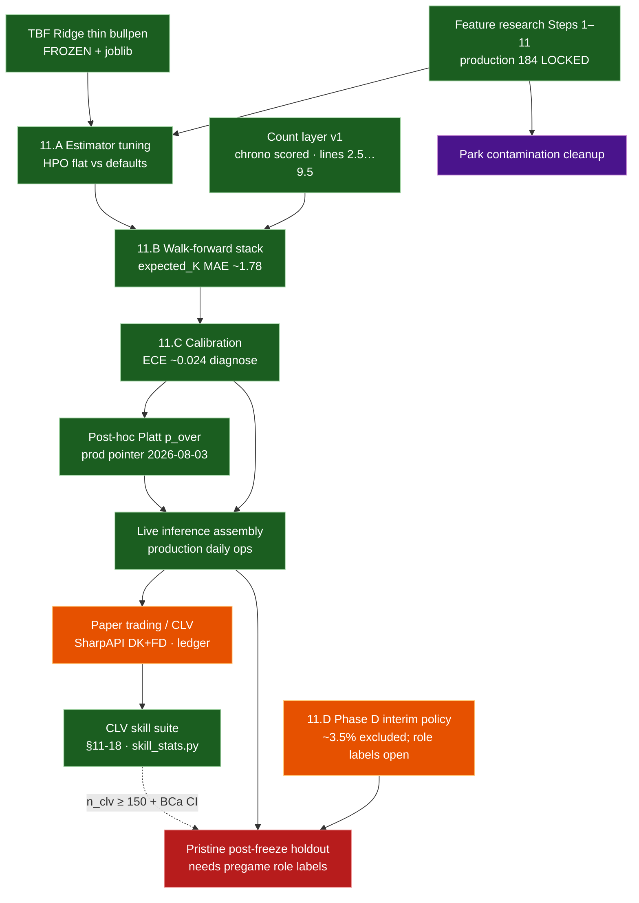

# 04 — Roadmap (decision-quality → live → market)

Research spine is **feature-frozen**. Phase 11.A–C was a **verification** pass
(small/no lifts). Phase D interim policy is frozen. Live assembly + paper
trading / CLV are **shipped**; dashed edges = still open.

## Status (2026-08-06)

| Track | State |
|---|---|
| Feature research (Steps 1–11) | **Done** — `production` **184** |
| TBF + count layer v1 | **Done** — `p_over` lines **2.5…9.5** |
| Phase 11.A–C model quality | **Done** — confirmatory |
| Post-hoc `p_over_*` calibration | **Done** — Platt production pointer; raw retained (`docs/research/prob_calibration_findings.md`) |
| Phase D opener/piggyback | **Interim policy** — role labels still open |
| Live assembly | **Shipped** — `production/` refresh → log → grade (`docs/reference/live_assembly_plan.md`) |
| Paper trading / CLV | **Shipped ops; sample building** — edge floor **12%** + ⅛ Kelly (frozen 2026-08-06) + tip closes (`docs/reference/market_clv_gates.md`) |
| CLV skill suite (dashboard) | **Shipped 2026-08-06** — `production/notebooks/results_dashboard.ipynb` §11-18: reliability plot + two-proportion z-test / band-discrete flat-1u / rolling 30-bet / stake-weighted / per-band histograms / pseudo-ROC / outcome-pairing scatter / **BCa**-CLV sweep / pre-registered next-50-bet checkpoint (`docs/research/notebook_change_log.md`) |
| Floor + Kelly freeze | **Logged** — `docs/research/floor_freeze_log.md` (ledger SHA-256 `cfddcf67…49e37`, n_clv = 72 at floor ≥ 12%, gate = n_clv ≥ 150); skill bar INCONCLUSIVE on resolved ledger (BCa CI `[-0.30, +1.78]` includes zero) |
| Pristine future holdout | **Protocol live** — `production/projections/post_freeze_holdout.py` (`docs/reference/post_freeze_holdout.md`); grows with `game_date >= 2026-07-28` |
| Lineup train/serve | **Documented** — first-9-by-PA vs announced; roster cascade `active → 40Man → fullSeason` |

## Why Phase 11 felt quiet

Gates exist to catch failure modes. Here the frozen defaults already sat near a
local optimum: nested HPO did not beat them; the stack held under walk-forward;
calibration did not need a patch. That is the intended outcome of a healthy
freeze — boring confirmation, not a new research story.

Canonical: `docs/research/phase11_model_quality_gates.md`,
`docs/research/phase_d_population_findings.md`, `docs/reference/live_assembly_plan.md`,
`docs/reference/market_clv_gates.md`,
`docs/research/floor_freeze_log.md` (floor + Kelly freeze),
`docs/research/notebook_change_log.md` (dashboard additions).

## Workload companions

| Phase | Status |
|---|---|
| A–C rest / volume / thin bullpen | **Done** (in TBF) |
| D opener/piggyback | **Interim policy** — `docs/research/phase_d_population_findings.md` |

## Later (not critical path)

### Ops / live

1. Grow post-freeze holdout; settle discipline after finals; optional always-on host for `close_watcher`.
2. Grow CLV sample to **n_clv ≥ 150 at floor ≥ 12%** (currently ~72). The
   pre-registered next-50-bet decision rule is frozen at
   `artifacts/odds_log/next_50_checkpoint.json`
   (`production/notebooks/results_dashboard.ipynb` §18b); on hit, escalate KB stake
   size; on miss, revert to ¼ Kelly at the 12% floor; on hold, re-evaluate at
   `n_clv = 200`. Floor/Kelly changes are recorded in
   `docs/research/floor_freeze_log.md`.
3. Pregame role ingestion (opener / piggyback) for pristine v1.
4. Doubleheader-safe schedule join hardening in `daily_lineups`.
5. Park-factor hygiene (neutral-site / international venue keys).

### Model / count-layer challengers

5. Negative-binomial / mixture-over-TBF challengers (count layer, not rate features)
   — still open if live ECE regresses after Platt.
6. Longer outer folds / stronger external floors if the goal shifts beyond leakage-safe stack.

Post-hoc **Platt** on `p_over_*` is shipped (not a count-family change):
`docs/research/prob_calibration_findings.md`.

### Deferred external baselines & enrichment (post–Marcel-lite)

Landed already: Marcel-lite krate floor
(`models/Strikeout-Model/research/marcel_baseline.py`, manuscript Table 3b);
paper-trading product layer (SharpAPI opens/closes — not a historical closing-line archive).

These are **optional** follow-ons if the goal shifts from “leakage-safe stack”
to “best available predictor / richer market check”:

| Idea | Why later | Notes / blockers |
|---|---|---|
| **Age curve on Marcel** | Small expected lift; cleans the talent baseline | Needs birthdates (not in `player_id_map`); pybaseball / Chadwick register |
| **Steamer / ZiPS / PECOTA as game k_rate floors** | Richer season systems than Marcel | Licensing / scrape ethics; usually season rates → map to game rows; still not matchup models |
| **Multi-year closing-line archive** | Stronger backtests than forward paper sample | Needs historical K-prop closes + de-vig; separate from modeling paper |
| **Weather / travel / catcher / umpire** | Possible rate or TBF signal | New leakage-safe joins; promote only via nested chrono screens |

Do **not** reopen the frozen 184-feature LightGBM set for these without a new
nested outer protocol and a pristine post-freeze holdout.
