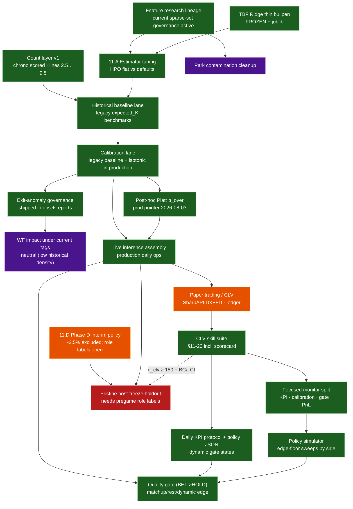

# 04 — Roadmap (decision-quality → live → market)

Research spine is feature-frozen with current sparse-set governance lanes.
Phase 11.A–C remains historical verification context. Live assembly + paper
trading / CLV are shipped; dashed edges = still open.

> **Live prioritization:** [`docs/EXECUTION_BACKLOG.md`](../EXECUTION_BACKLOG.md)
> (FORWARD / DEFERRED). This roadmap diagram is research status, not the ops queue.
>
> Metric lane note: deployment champions are selected on decision metrics, while
> single-model MAE winners are tracked separately in
> `docs/reference/governance_metric_stack.md`.

## Status (2026-08-11)

| Track | State |
|---|---|
| Feature research (Steps 1–11) | **Done** — legacy freeze lineage retained; sparse-set governance active |
| TBF + count layer v1 | **Done** — `p_over` lines **2.5…9.5** |
| Phase 11.A–C model quality | **Done** — confirmatory |
| Post-hoc `p_over_*` calibration | **Done** — Platt production pointer; raw retained (`docs/research/prob_calibration_findings.md`) |
| Phase D opener/piggyback | **Interim policy** — role labels still open |
| Live assembly | **Shipped** — `production/` refresh → log → grade (`docs/reference/live_assembly_plan.md`) |
| Paper trading / CLV | **Shipped ops; sample building** — edge floor **12%** + ⅛ Kelly (frozen 2026-08-06) + tip closes (`docs/reference/market_clv_gates.md`) |
| CLV skill suite (dashboard) | **Shipped 2026-08-06** — `production/notebooks/results_dashboard.ipynb` §11-20: reliability, residual decomposition, chrono recalibration test, and daily scorecard (`docs/research/notebook_change_log.md`) |
| Focused monitor split | **Shipped 2026-08-11** — `results_kpi_monitor`, `results_calibration_lab`, `results_gate_policy`, `results_pnl_clv` |
| Policy simulator CLI | **Shipped 2026-08-11** — `production/ops/policy_simulator.py` writing scenario artifacts |
| Daily KPI + dynamic gate policy | **Shipped** — `production/ops/kpi_policy.json`, `production/ops/kpi_daily_action.py`, `docs/reference/daily_kpi_protocol.md` |
| Quality gate in live odds flow | **Shipped** — `production/odds/odds_board.py` and `production/odds/poll_odds.py` (`--quality-gate`) |
| Floor + Kelly freeze | **Logged** — `docs/research/floor_freeze_log.md`; skill remains under ongoing governance monitoring |
| Pristine future holdout | **Protocol live** — `production/projections/post_freeze_holdout.py` (`docs/reference/post_freeze_holdout.md`); grows with `game_date >= 2026-07-28` |
| Lineup train/serve | **Documented** — first-9-by-PA vs announced; roster cascade `active → 40Man → fullSeason` |
| Chrono recalibration promotion gate | **In progress** — compare raw vs isotonic vs Platt after `>=15` distinct dates |
| Exit-anomaly governance | **Shipped** — override/mask/report loop + rolling-policy PASS/WARN + WF A/B/sensitivity runners |
| Historical anomaly effect size | **Neutral so far** — low tagged density in 2023-2024 backfill |

## Why Phase 11 felt quiet

Gates exist to catch failure modes. Here the frozen defaults already sat near a
local optimum: nested HPO did not beat them; the stack held under walk-forward;
calibration did not need a patch. That is the intended outcome of a healthy
freeze — boring confirmation, not a new research story.

Canonical: `docs/research/phase11_model_quality_gates.md`,
`docs/research/phase_d_population_findings.md`, `docs/reference/live_assembly_plan.md`,
`docs/reference/market_clv_gates.md`,
`docs/research/floor_freeze_log.md` (floor + Kelly freeze),
`docs/research/notebook_change_log.md` (dashboard additions).

## Workload companions

| Phase | Status |
|---|---|
| A–C rest / volume / thin bullpen | **Done** (in TBF) |
| D opener/piggyback | **Interim policy** — `docs/research/phase_d_population_findings.md` |

## Later (not critical path)

### Ops / live

1. Grow post-freeze holdout; settle discipline after finals; optional always-on host for `close_watcher`.
2. Continue CLV sample growth and confidence tightening at floor ≥ 12%. The
   pre-registered next-50-bet decision rule is frozen at
   `artifacts/odds_log/next_50_checkpoint.json`
   (`production/notebooks/results_dashboard.ipynb` §18b); on hit, escalate KB stake
   size; on miss, revert to ¼ Kelly at the 12% floor; on hold, re-evaluate at
   `n_clv = 200`. Floor/Kelly changes are recorded in
   `docs/research/floor_freeze_log.md`.
3. Pregame role ingestion (opener / piggyback) for pristine v1.
4. Doubleheader-safe schedule join hardening in `daily_lineups`.
5. Park-factor hygiene (neutral-site / international venue keys).

### Model / count-layer challengers

6. Negative-binomial / mixture-over-TBF challengers (count layer, not rate features)
   — still open if live ECE regresses after Platt.
7. Longer outer folds / stronger external floors if the goal shifts beyond leakage-safe stack.

Post-hoc **Platt** on `p_over_*` is shipped (not a count-family change):
`docs/research/prob_calibration_findings.md`.

### Deferred external baselines & enrichment (post–Marcel-lite)

Landed already: Marcel-lite krate floor
(`models/Strikeout-Model/research/marcel_baseline.py`, manuscript Table 3b);
paper-trading product layer (SharpAPI opens/closes — not a historical closing-line archive).

These are **optional** follow-ons if the goal shifts from “leakage-safe stack”
to “best available predictor / richer market check”:

| Idea | Why later | Notes / blockers |
|---|---|---|
| **Age curve on Marcel** | Small expected lift; cleans the talent baseline | Needs birthdates (not in `player_id_map`); pybaseball / Chadwick register |
| **Steamer / ZiPS / PECOTA as game k_rate floors** | Richer season systems than Marcel | Licensing / scrape ethics; usually season rates → map to game rows; still not matchup models |
| **Multi-year closing-line archive** | Stronger backtests than forward paper sample | Needs historical K-prop closes + de-vig; separate from modeling paper |
| **Weather / travel / catcher / umpire** | Possible rate or TBF signal | New leakage-safe joins; promote only via nested chrono screens |

Do **not** reopen frozen production feature sets for these without a new
nested outer protocol and a pristine post-freeze holdout.
