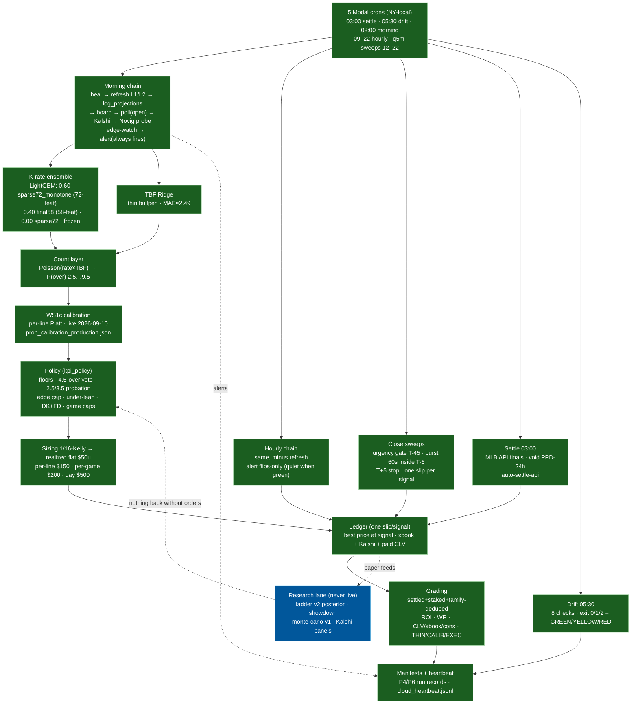

# 05 — Live prediction flow (production, as of 2026-09-24)

How a slate becomes money (or paper) tracking, end to end. Research-era
training is `03`; this file is the thing that runs every day.

## Layers (modeling → money)

| # | Layer | File / artifact | Frozen? |
|---|---|---|---|
| 1 | K-rate ensemble | `src/Python/live_assembly.py` + `live_krate_ensemble.json` | Yes (prod-184) |
| 2 | TBF Ridge | `src/Python/pipeline/` + TBF bundle | Yes |
| 3 | Count layer (Poisson) | `src/Python/market.py` (`p_strikeouts_ge`) | Yes |
| 4 | WS1c per-line Platt | `artifacts/models/prob_calibration_production.json` | Yes (2026-09-10) |
| 5 | Policy + floors + vetoes | `production/ops/kpi_policy.json` | Tunable (orders) |
| 6 | Sizing 1/16-Kelly + caps | `src/Python/market.py` | Frozen |
| 7 | One-slip ledger + 3-source CLV | `artifacts/odds_log/ledger.parquet` | Live |
| 8 | Grading + manifests + drift | `send_daily_grading.py` / `run_manifest.py` / drift | Live |

## Grading: before AND after (owner Q 2026-09-24)

- **Before first pitch (at signal):** edge vs books, model prob vs market prob,
  CLV expectation implicit in edge floor ≥12%. Recorded on every ticket.
- **After final (settle + grading):** ROI/WR on settled+staked+dedeuped,
  same-book CLV, xbook CLV, paid-consensus CLV, trailing-200 beat rule,
  THIN/CALIB/EXEC flags. Plus calibration-vs-actuals research
  (Brier/logloss/ECE notebooks + ladder showdown).
- **Independent recomputation (money-on-the-line discipline):**
  grading math re-derived three ways — daily grading message,
  `paper_quant` track, gate-next-N artifact — plus content-hash pins on
  kpi/krate/ws1c in every manifest and 500+ CI tests. A number that can't
  be recomputed from the ledger doesn't ship in a page.

## Notes

- Research sims (ladder v2, monte-carlo v1, Kalshi panels) read the ledger
  and write reports; no arrow points back into policy without owner orders.
- Season end 2026-09-27: `season.postseason = hold_all_no_bets` in policy.
- Cron cap: 5 Modal schedules — new jobs fold in as steps, never schedules.
