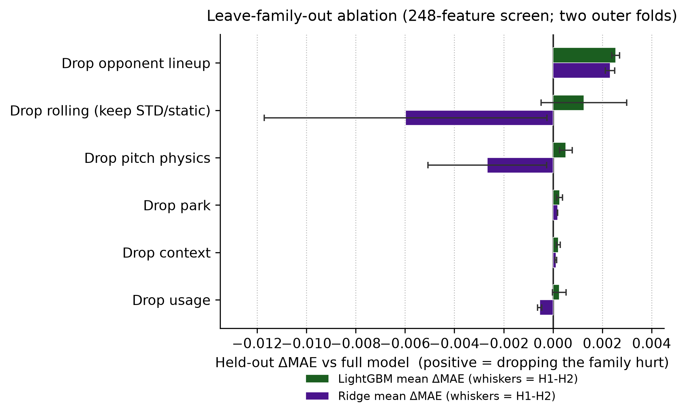
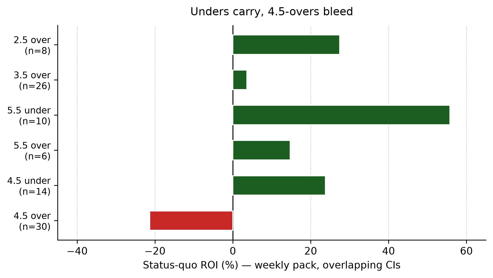
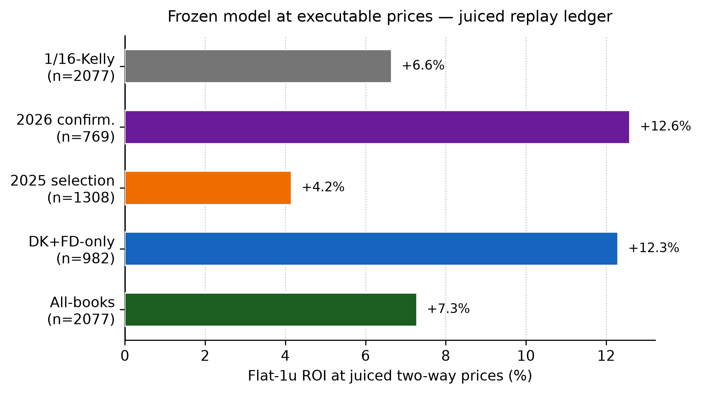
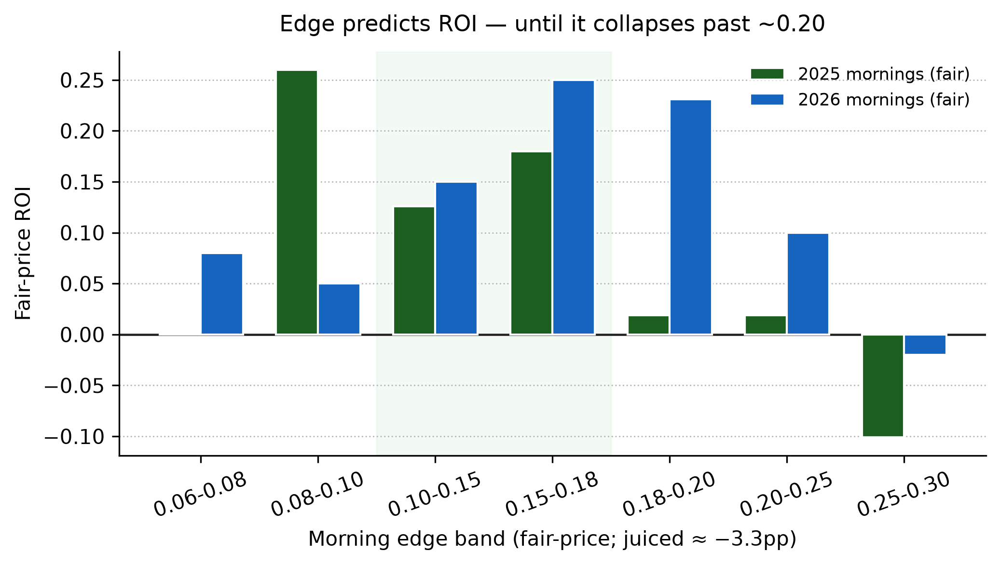
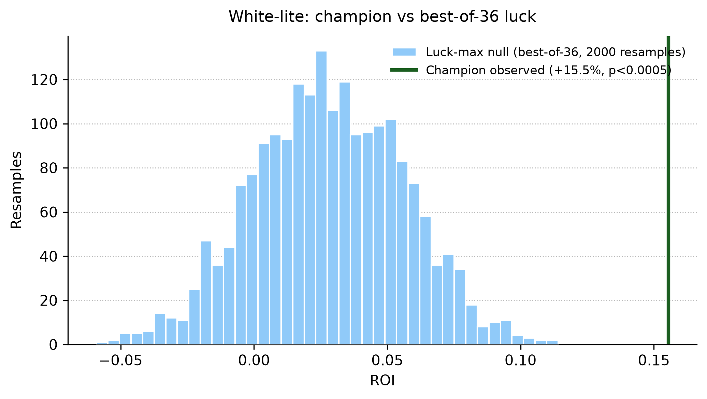
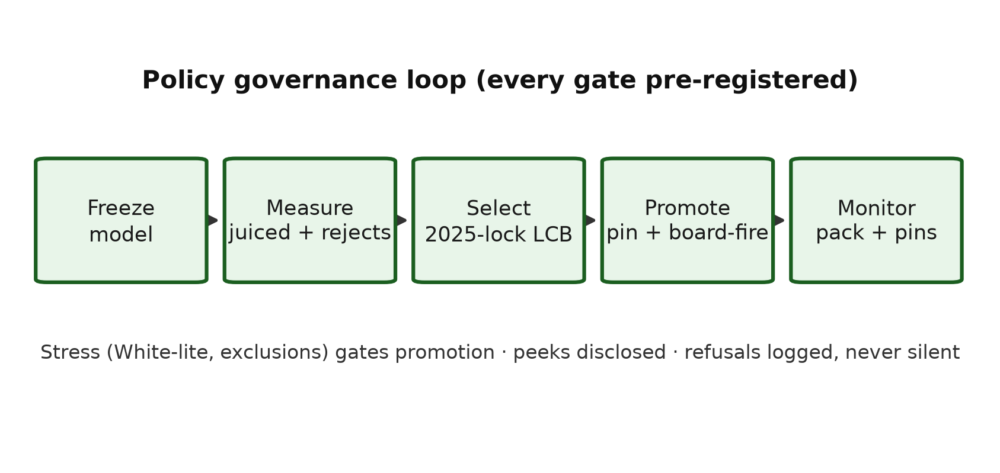

# Leakage-Safe Pregame Pitcher Strikeout Projection

**A quant ML engineering study of rate modeling, exposure projection, and governed policy selection**

Cameron Kaplinger
Independent Researcher

*Technical report · v2026-09-11 · All measurements as of 2026-09-11*

**Code repository:** [https://github.com/Cbkaplinger/MLB-Props](https://github.com/Cbkaplinger/MLB-Props)

**Acknowledgments.** Baseball Savant / Statcast pitch-level data provided the empirical foundation for this work.

---

## Abstract

We study pregame strikeout forecasting for MLB starting pitchers under a strict pregame information constraint: a leakage-safe strikeout-rate model multiplied by a projected-batters-faced model yields expected strikeouts and P(K >= L) line probabilities without same-game inputs. The frozen LightGBM-plus-Ridge stack beats a Marcel baseline by about 0.004 k-rate MAE on chronological splits, then converts through a Poisson count layer with per-line calibration. For decisions, a pre-registered 36-configuration policy family scored on 2025 data selects floor 0.12, edge cap 0.24, under-lean, and DK+FD-only books: 558 tickets at +15.5% ROI with a slate-clustered lower confidence bound of +7.4%, confirmed by a White-style reality check (p < 0.0005) and repeated once on 2026 at +15.6% (disclosed peek, not a pristine holdout). Probabilities do not beat book closes on skill (−0.0043 Brier skill); the measured value comes from clock, ticket, and book selection, and every return figure is paper at recorded prices with fills unmodeled.

---

## 1. Introduction

Strikeout props are a natural target for pregame modeling: the outcome is well-defined, Statcast supplies rich pitch- and PA-level detail, and the quantity of interest separates into a rate component and an exposure component. Many published baseball analytics workflows emphasize descriptive leaderboards or postgame attribution. Betting-oriented systems often blur the pregame information set. This work treats the problem as supervised prediction under a strict pregame constraint: estimate a starter's strikeout rate before first pitch, project how many batters that starter will face, and convert the pair into expected strikeouts and P(K >= L) for common prop lines L, for starters who face at least nine batters.

The modeling claim is compositional. A leakage-safe estimate of strikeout rate, multiplied by a leakage-safe projection of batters faced, yields expected strikeouts and line probabilities without ever using same-game outcomes as inputs: k_rate × TBF → E[K] → P(K >= L) (§3–§4).

Contributions:

1. A leakage-safe three-level feature architecture with hard chronological rules (§3).
2. A frozen rate × exposure model stack that beats a Marcel baseline on chronological splits (§4–§5).
3. A pre-registered 2025 policy selection with stress testing that promotes one champion (§6).
4. A deployment and governance design that pins every live value and reverts what does not validate (§7).
5. An honest-boundary accounting: negative skill versus closes, paper-only fills, disclosed peeks (§8–§9).

Terminology. A lane is an evaluation track (model, decision, deployment). Policy refers to the filter-and-size layer applied to frozen probabilities (floors, vetoes, caps, books, sizing) — never to model weights. Overnight Odds API quotes are pre-open consensus prices at approximately T−12h. White-lite is a simplified, slate-clustered variant of White's Reality Check [13]. The frozen policy profile is versioned in the repository and cited by hash in Appendix A.7.

**Figure 1.** Leakage-safe architecture. Raw Statcast pitches aggregate into game records (Level 1), lagged rolling form (Level 2), and a model-ready training frame (Level 3), feeding a LightGBM rate model and a Ridge exposure model whose product enters the count layer.

## 2. Related Work

**Sabermetric rate-based pitching models.** Fielding Independent Pitching (FIP) and related estimators such as xFIP summarize pitcher skill from strikeouts, walks, hit batsmen, and home runs (or home-run rates normalized by fly-ball environment), reducing dependence on balls in play and defensive context [7, 8]. Those metrics are primarily descriptive or talent-estimation tools at the season or large-sample level. The present work is complementary: it retains FIP/xFIP-style components as *candidate features*, but the prediction target is game-level `k_rate` under an explicit pregame information constraint, not a restatement of FIP as the forecast.

**Season-level baseball projection systems.** Systems such as Marcel [9], PECOTA [10], Steamer, and ZiPS forecast season (or rest-of-season) player rates from weighted recent performance, regression to the mean, aging, and—depending on the system—comparable-player paths. They are useful conceptual baselines for talent estimation, while this manuscript focuses on production pregame decision governance under chronological constraints.

**Chronological evaluation and leakage control.** When targets are ordered in time, randomly reshuffled cross-validation overstates accuracy by allowing future information into training folds [11]. Forecasting practice therefore prefers expanding or rolling windows and features that are known at the forecast origin. This paper treats those constraints as hard engineering rules (shifted rolling windows, prior-season park factors, date-disjoint partitions) and verifies them with tests and audits rather than as an after-the-fact caveat.

**Count models for rate × exposure.** Once a mean rate and an exposure (here, projected batters faced) are specified, Poisson or binomial probabilities are standard for count outcomes [3, 4]. Line probabilities use those trials on *projected* exposure only. A beta-binomial dispersion check collapses to the binomial limit under the frozen mean, consistent with a well-specified mean model absorbing extra-binomial variance [4].

**Governed decisioning and performance evaluation.** Reporting strategies built on small, post-selection samples are vulnerable to overstatement. The Bailey–López de Prado performance-evaluation framework—Deflated and Probabilistic Sharpe Ratios with trial-count adjustment—provides a principled way to deflate observed risk-adjusted returns for the number of configurations searched [12]. This manuscript adopts that framework (§8.2–§8.4) and complements it with market-relative skill diagnostics (Brier/LogLoss skill vs market) and closing-line-value (CLV) as decision-level evidence, consistent with practice standards that separate model accuracy from market edge.

---

## 3. Data and Problem Setup

Because the stack multiplies rate by exposure, both quantities must be built from the same leakage-safe information set. The pipeline below is the shared foundation for that claim (Figure 1).

### 3.1 Source

Pitch-level regular-season Statcast via Baseball Savant (local parquet cache, seasons 2015–2026 retained for coverage; **model fitting uses 2023–2024 rows**). Season 2022 supplies prior-only park and league context for 2023 boundaries and does not enter training rows. Postseason files are retained but not used in the strikeout stack documented here.

### 3.2 Three levels

**Table 1.** Three-level pipeline outputs.

| Level        | Role                                   | Primary outputs                                                     |
| ------------ | -------------------------------------- | ------------------------------------------------------------------- |
| 1 · Games    | Pitch → starter/batter game aggregates | `pitcher_games`, `batter_games`, `pitch_type_games`, `park_factors` |
| 2 · Rolling  | Leakage-safe lagged form + context     | `pitcher_rolling`, `batter_rolling`                                 |
| 3 · Training | Join lineup + park into model frame    | `pitcher_training`, `batter_training`                               |

Level 1 is the audit surface: denominators, events, and identities are defined once. Level 2 applies rolling and season-to-date windows with an explicit lag so the game being predicted never contributes to its own features. Level 3 assembles opponent-lineup aggregates and prior-season park factors.

Implementation is Polars-first, with automated tests for feature safety, pipeline stages, and the trainer/splitter. Repository paths and artifact names are collected in Appendix A.

### 3.3 Population filter

Default research rows require PA ≥ 9. This is a **postgame** cohort definition for a **pregame** model: it does not leak feature values, but it conditions every reported metric. Population audits show excluded share ≈ **3.5%** (2023–2024). Cutoffs 8–10 change exclusion by about half a percentage point; nine remains the frozen policy.

---

### 3.4 Leakage rules

Leakage control is what makes the rate × exposure claim scientifically meaningful: if same-game outcomes contaminate features, both models become postgame reconstructions rather than pregame forecasts.

The following rules are treated as hard constraints:

- Same-game K, PA, Outs, and `k_rate` are labels / evaluation fields only.
- Rolling and season-to-date player statistics are shifted by one game or start.
- Season-to-date windows reset at season boundaries.
- Park factors for season Y use only seasons before Y.
- Opponent lineup aggregates use each batter’s **pregame** form; historical membership is the first nine distinct batters by first PA.
- Train / validation / test splits are chronological; a calendar date lies in exactly one partition.
- Unexpected numeric columns are rejected unless they match approved pregame naming rules.

Verification combines notebook spot checks (first start of season, season boundary resets, manual rolling recomputation) with an automated test suite. Process bugs (for example relocated-park blending; Section 9) were logged with before/after evidence in the research log.

**Evaluation scope.** Development metrics use 2023–2024 chronological partitions and nested folds. Any 2025 reporting is treated as non-selection context rather than a pristine post-freeze holdout, except where §6 explicitly pre-registers 2025 as the policy-selection set.

---

## 4. Methods

With the information set fixed, feature design is a selection problem: keep only pregame signals that survive chronological evaluation. Models then convert those inputs into rate and exposure, then into count probabilities.

Notation (used once here, never redefined): k_rate is the game strikeout rate (K/PA); TBF is batters faced (projected, pregame); E[K] is expected strikeouts; P(K >= L) is the line probability; p_model is our taken-side probability; p_market is the devigged market probability; edge = p_model − p_market; CLV_pp is closing line value in probability points.

### 4.1 Active feature sets

The rate lane is maintained through three frozen sets:

- `production_sparse72` (compact baseline),
- `production_sparse72_monotone` (same sparse spine with monotone constraints),
- `production_final58_consensus` (consensus-pruned compact set).

These sets are evaluated both as individual models and as ensemble members.

### 4.2 Monotone-constraint implementation scope

Monotone constraints are implemented in the LightGBM production lane because that path is hardened in the current training/evaluation stack [1]. XGBoost also supports monotonic constraints, and Aug 2026 parity runs include explicit constrained-vs-unconstrained XGBoost comparisons.

### 4.3 Model selection criteria

Production promotion decisions are driven by:

1. feature-level pruning outcomes on frozen sparse sets,
2. rolling-window sensitivity checks,
3. out-of-sample market-skill governance lanes (open and deduped manual),
4. deployment robustness (calibration transfer and parity checks).

Family ablation serves as a challenger screen, while production promotion is determined in the governance lane.

### 4.4 Empirical-Bayes shrinkage in features

The production feature pipeline uses empirical-Bayes style shrinkage selectively to stabilize low-sample pregame rates:

- `src/Python/batter_rolling.py`: batter rolling K% shrinkage (`k_rate_std_shrunk`) toward batter prior + league prior with pseudo-PA strength.
- `src/Python/pitcher_rolling.py`: prior-season shrunk pitcher K/PA (`add_prior_season_shrunk_k`) and low-sample pitch-type shrinkage toward prior-date league means.
- `src/Python/pitcher_features.py`: league HR/FB prior smoothing (`lg_hr_fb_prior`) with explicit prior-strength blending.

This gives cold-start and small-sample rows a stable prior-date fallback while preserving leakage safety (no same-game outcomes in predictors).

---

### 4.5 Strikeout-rate lane (models convert §4.1–4.4 inputs into rate and exposure)

**Table 2.** Active rate-model structure.

| Component | Role |
| --- | --- |
| LightGBM (`sparse72_monotone`) | Ensemble member with monotone constraints |
| LightGBM (`final58`) | Ensemble member |
| Active blend (`0.60 / 0.40`) | Active production scorer (`sparse72_monotone`, `final58`) |

The production decision is not a single-model claim; it is a governed ensemble
choice validated across open-universe and deduped-manual lanes.

**Table 2a.** Current contender `k_rate` MAE (model-family lane, sparse-set run).

Table 2a is a challenger-screen table for single-model error behavior on shared sparse feature sets; it is not the deployment champion table.

| Rank | Model family | Feature set | Mean `k_rate` MAE |
| --- | --- | --- | ---: |
| 1 | ridge | `production_sparse72` | 0.07668 |
| 1 (tie) | ridge | `production_sparse72_monotone` | 0.07668 |
| 3 | lightgbm | `production_sparse72_monotone` | 0.07669 |
| 4 | lightgbm | `production_sparse72` | 0.07707 |
| 5 | histgbr | `production_sparse72` | 0.07721 |

**Table 2b.** Chronological game-level naive baselines (Marcel lane; **not** the Table 2a outer-fold protocol).

| Baseline | Test `k_rate` MAE | n | Notes |
| --- | ---: | ---: | --- |
| Marcel (3/2/1 + EB regress, no age) | 0.08257 | 1413 | `marcel_baseline.py` |
| Prior-season only | 0.08301 | 1413 | same split |
| Train-mean | 0.08538 | 1413 | same split |
| Frozen LightGBM (registry freeze ref.) | ≈0.0787 | — | same test start; not re-fit here |

Delta over Marcel for the freeze reference: ≈ **−0.0039** absolute MAE. Sparse72 ridge **0.07668** (Table 2a) cannot be subtracted from Marcel without fold-aligned preds — different evaluation contract. Source: `docs/reference/reports/ssac27_naive_mae_baseline_2026-09-01.md`.

The current ensemble-sweep ranking artifact does **not** include `k_rate` MAE
columns; it is ranked on decision metrics (ROI/risk/market-skill). Therefore,
ensemble `k_rate` MAE is reported as **not available in that artifact lane**.
Also, family-model tags in this lane reflect a mixed budget (some default configs,
some small inner-fold tuning), so rankings should be read as practical challenger
screens rather than a perfectly equal hyperparameter-budget bakeoff.

Why Ridge can rank first in Table 2a and not be the deployment champion:

1. Table 2a is a **single-model `k_rate` error lane**.
2. Deployment championing is a **full decision lane** (`k_rate × TBF → P(K >= L)` with market-skill and risk metrics).
3. A tiny `k_rate` MAE edge does not guarantee better calibrated line probabilities or better realized risk-adjusted return after exposure, pricing, and bet-selection gates.

**Note: Why ensemble over single model (paper/interview short form)**

- **Single model = best point forecaster** in chronological MAE lanes.
- **Ensemble = best deployable decision engine** after calibration + market/risk governance.
- The project selects single-model leaders for challenger tracking and model-quality reference.
- The project selects deployment champions on decision metrics (skill vs market, ROI, Sharpe/Sortino, drawdown, CLV behavior).
- Therefore, “best MAE model” and “best deployed profile” can differ without contradiction.

### 4.6 Projected batters faced (TBF)

Rate alone is not a strikeout count. The second factor is projected batters faced: same-game PA is used only as a historical exposure oracle for training and evaluation, never as a predictor. Predictors include rest, lagged PA / Outs / Pitches, home/park/lineup K context, and thin team bullpen L1–L3d pitch/pitcher-use lookbacks (**24** features).

**Frozen choice:** Ridge with the thin bullpen feature set (coefficients persisted for reproducible scoring).

### 4.7 Count layer

The count layer is where rate and exposure become the paper’s target quantities, following the standard mean × exposure construction for count probabilities [3, 4]:

<code>E[K] = k_rate_hat × TBF_hat</code>

P(K >= L) via Poisson with n = round(TBF_hat) (live default as of 2026-09-10; binomial is a one-line revert in `src/Python/count_layer.py`)

Same-game PA never enters prop probabilities. A 2026-09-09 same-subset race on the close-matched universe preferred Poisson on 7/8 lines; that is why production swapped the family, not a search-lane ROI.

Model evaluation uses the lanes of §4: decision-lane quality (market-skill, replay ROI/risk path, deployment robustness) over legacy internal MAE tables alone.

---

## 5. Model Evaluation

The ablation framework has two jobs: (a) quantify single-model sensitivity on chronological partitions, and (b) screen challengers for the ensemble. Every number here comes from 2023–2024 partitions or the stated 2025 holdout protocol.

### 5.1 Current protocol

- Outer chronology: anchored walk-forward windows.
- Inner chronology: model/feature tuning only inside training spans.
- Final rank surface: open-universe skill first, then deduped one-opportunity manual replay, then deployment checks.

### 5.2 Current takeaway

Current decisions are made on compact frozen sets (`sparse72_monotone`, `final58`) and their weighted ensemble behavior.

**Figure 2.** Leave-family-out ablation: dropping opponent-lineup and rolling context hurts most; pitch physics matters least. Whiskers span the two outer folds.

### 5.3 XGBoost monotone in the promotion workflow

XGBoost monotonic constraints were evaluated in follow-up parity runs against the hardened LightGBM monotone path (constraint mapping, validation, artifact lineage). Promoting an XGBoost-monotone lane would require its own constraint-sign audit and equal governance contract. Verdict: **tested as a challenger, did not clear the sparse-lane bar** — unconstrained (`expected_K` MAE `1.8451`) and monotone (`1.8511`) both trailed LightGBM and Ridge at base budget, and tuned-small variants (`~1.8242` / `~1.8352`) stayed behind with Ridge the MAE leader. The decision-lane bridge confirmed MAE rank does not map one-to-one to market/risk profile. Detail: parity snapshots in Appendix A.5.

---

## 6. Decision-Policy Evaluation

Component metrics are necessary but incomplete. Once rate and TBF are frozen, the object that must be judged is the full composition — frozen probabilities, executable prices, and a pre-registered filter — on three lanes: rate accuracy, market skill with chronological discipline, and realized risk-adjusted return with rejected candidates retained. Winners are not interchangeable across lanes.

**Table 3.** Primary decision results (frozen model; fills unmodeled throughout).

| Scope | n | Result |
| --- | ---: | --- |
| 2025-lock champion (pre-registered family, 2025 only) | 558 | ROI +15.5%, WR 0.60, LCB +7.4%, CLV +1.24pp; floor 0.12 / cap 0.24 / under-lean / DK+FD-only |
| Disclosed-peek 2026 judge (one look) | 485 | ROI +15.6%, WR 0.60, LCB +7.3%, CLV +1.30 — repeats; labeled peek, not clean |
| Juiced replay, flat 1u | 2,077 | ROI +7.3%, WR 0.506, CLV +1.08pp; DK+FD-only +12.3% (n=982); 2025 +4.2% / 2026 +12.6% confirmatory; 1/16-Kelly +6.6% |
| Deduped paper ledger (36 days) | 317 | PnL +$611 (+2.7% ROI); mean CLV +0.75pp on 195 CLV rows; veto lane +6.5% (n=258) |
| Universe close skill (live config) | 19,533 | Brier 0.2204 vs book 0.2162 (skill −0.0043); ECE 0.021 vs 0.009 — negative on all eight lines |
| Timing vs overnight quotes (≈T−12h) | 7,986 | Skill +0.044 at open, decaying to ~0 by T−5h morning |

Provenance for every row: Appendix A.7. Retired search-lane figures (n=26 policy search, fair-price harness) live only in Appendix A.5.

### 6.1 Over/under asymmetry

The edge floor preferentially takes tickets where the model over-predicts expected strikeouts by +0.7–0.9 against +0.05 globally: over-bleed is a selection amplifier on top of a probability problem. Weekly Brier skill is +0.06 on unders against −0.15 on overs; the 4.5-over cell loses −21% (n=30, WR 0.40) while 4.5-under makes +24% (n=14). That asymmetry promoted the 4.5-over veto as risk control, probation on 2.5/3.5-overs, and ultimately the under-lean premium — and an independent 2025-lock re-discovered "lean under" without being told.

**Figure 3.** Status-quo line-by-side ROI: unders carry, 4.5-overs bleed.

### 6.2 Decision clock and executable measurement

The same frozen starts beat overnight quotes (skill +0.044) and trail by morning — edge lives at −12h and is gone by T−5h, so the decision clock is overnight-else-morning and the close is evaluation only. At executable juiced prices the flat-1u ledger prints +7.3% all-books (+12.3% DK+FD), with 1/16-Kelly trailing at +6.6%: sizing does not manufacture the signal.

**Figure 4.** Flat-1u juiced ROI by slice (frozen probs, live policy as filter, rejected rows kept).

Morning edge bands humps then collapses past ~0.20 in both years (fair-price mornings; juiced ≈ −3.3pp): edge predicts ROI inside 0.08–0.18 and inverts beyond it — extreme disagreement means the model is wrong, not bold. That hump is the edge cap's evidence.

**Figure 5.** Morning edge-band ROI hump (fair-price mornings). The green band is the durable core; the cliff past ~0.20 motivates the cap.

### 6.3 Pre-registered selection and stress

The retired fair-price harness searched 56 configs on fair probabilities and peeked 2026 twice. Its replacement is a juiced, pre-registered, once-only design: a locked 36-config family (uniform floors {0.08, 0.10, 0.12} × edge caps {0.18, 0.20, 0.24} × side rules {both, under-lean} × book universes {next-book, DK+FD-only}; veto and probation stand outside the search), scored on 2025 only, championed by max lower-confidence-bound ROI on slate-clustered block bootstrap subject to CLV ≥ 0, no line-by-side cell over 40% of PnL, DK+FD sign agreement, and n ≥ 200.

Result: floor 0.12, cap 0.24, under-lean, DK+FD-only — 2025 ROI +15.5% (n=558, WR 0.60, LCB +7.4%, CLV +1.24pp), repeated once on 2026 at +15.6% (n=485, disclosed peek, not clean). The largest lever is book choice, not probability.

**Figure 6.** White-lite null distribution against the observed champion. Best-of-36 luck prints +2.8% typically and +7.4% at its wildest; the observed +15.5% clears it (p < 0.0005, demeaned null, 2,000 slate-clustered resamples).

**Figure 7.** Policy governance loop. Every gate is pre-registered; stress stands between selection and promotion.

### 6.4 Start-level cases (illustrative, n=3)

Three individual starts convey decision behavior under uncertainty; no directional inference should be drawn from them, and aggregate evidence is governed by §6. A high-edge under and a high-edge over settled as wins; a high-edge under settled as a loss despite positive pre-bet edge and positive CLV. Edge/CLV signal can be directionally useful while individual outcomes remain noisy at start level.

These checks are confirmatory: they did not uncover large unused gains on the frozen stack’s internal metrics.

---

## 7. Deployment and Governance

Live operations run a compact three-lane model: open-universe skill ranking, deduped paper decisions, and a frozen deployment lane that fails closed on parity and quality gates — no automatic promotion until reconciliation re-clears.

Live configuration as of the 2026-09-11 freeze: 0.60/0.40 blend, Poisson counts, WS1c maps, line floors with 4.5-over veto and 2.5/3.5 probation, edge cap 0.24, under-lean premium 0.04 on overs, DK+FD-only books, offsets clipped at ±0.02, 1/16-Kelly sizing, postseason hold. A same-day robust-refusal arm was reverted on selection-year evidence; stacker and brake remain unshipped. Full key list: Appendix A.7.

**Deployment vignette (one ticket through the whole stack).** Morning board: Blake Snell under 7.5, FanDuel −130, expected K 5.80, model edge 19.3%, sized 1.47u ($73.48) at 1/16-Kelly. The ticket clears every layer visibly: line floor 0.12 (7.5), no veto (under), no probation (not 2.5/3.5-over), edge under the 0.24 cap, no lean premium (under), DK/FD book, TBF gate, deploy segment on. One ticket, every gate legible, policy version reconstructible from raw JSON and frozen hashes.

## 8. Related Diagnostics

Supporting measurements that constrain — but do not select — policy. Post-freeze ledger lane (locked profile, stake > 0): n=74 at −1.6% ROI with the bleed concentrated in overs (n=45, −24.6%) against unders (n=29, +29.3%); matched random/naive nulls run redder still.

**Table 4.** Per-line universe skill, live config (n=19,533 close-matched).

| Line | n | Our Brier | Book Brier | Skill | Our bias (pp) |
| ---: | ---: | ---: | ---: | ---: | ---: |
| 2.5 | 1,791 | 0.1847 | 0.1825 | −0.0022 | −0.9 |
| 3.5 | 3,883 | 0.2218 | 0.2176 | −0.0041 | −1.6 |
| 4.5 | 4,903 | 0.2343 | 0.2293 | −0.0050 | −1.6 |
| 5.5 | 4,400 | 0.2255 | 0.2194 | −0.0061 | −1.6 |
| 6.5 | 2,764 | 0.2163 | 0.2131 | −0.0032 | −2.9 |
| 7.5 | 1,265 | 0.2139 | 0.2119 | −0.0020 | −4.5 |
| 8.5 | 420 | 0.1957 | 0.1951 | −0.0006 | −3.2 |
| 9.5 | 107 | 0.2072 | 0.1981 | −0.0091 | −5.3 |

Calibration ships with the probabilities: universe ECE 0.021 against book 0.009 (pre-deployment walk-forward ECE ≈ 0.024 on n=4,607 raw predictions — internal check, not a deployed claim). Slate correlation is measured but unbuilt policy: 533 games carry 2+ taken tickets (1,633 correlated pairs), and the weekly veto pack reads +14.3% against +7.2% status-quo with overlapping intervals — monitoring, not promotion fuel. Parity-plus-governance refresh runs about 23 minutes wall-clock on the local workstation.

**Figure 8.** Count-layer reliability diagram. Points near the diagonal indicate calibrated bins; marker size scales with bin count.

 Per-line universe skill (live config, n=19,533) is negative on all eight lines with the worst gaps mid-curve:

### 5.4 Model-driver evidence

Interpretability here is stable directional evidence, not one-off importance ranks: Ridge is the best single-model MAE challenger (expected_K ≈ 1.7621, k_rate ≈ 0.07668), LightGBM-monotone stays near-frontier (≈ 1.7689) while preserving the production path, and XGBoost trailed in both forms. MAE rank and deployment rank diverge by design. Full evidence list: Appendix A.7.

### 8.9 Operational benchmark snapshot (local workstation)

Parity-plus-governance refresh runs about 23 minutes wall-clock on the local workstation (sparse-lane parity ~234s/797s, governance bridge ~120s/235s). Fail-closed controls gate every promotion.

---

## 9. Limitations

**Population scope.** Reported core metrics use the PA ≥ 9 cohort and therefore describe conventional-length starts.

**Game-level variance ceiling.** Even with modern features and ensemble blending, pitcher-game outcomes retain substantial irreducible variance.

**Exogenous signal coverage.** Some high-impact context channels (weather micro-effects, travel fatigue, umpire framing) remain outside the frozen production feature set.

**Statistical confidence.** The n=26 search lane that motivated the DSR analysis is retired as evidence; current inference rests on the juiced taken set (`n=2,077`), the 2025 selection slice (`n=558` champion), and the universe panel (`n=19,533`). Trial-adjusted significance on the *policy* family is now carried by the White-lite check (p<0.0005 on 2025) rather than the blend-search DSR — but the 2026 judge is a disclosed peek, not a pristine holdout, and regime change (September dilution, playoff-race lineups) is outside every test run.

**Interpretability breadth.** This version includes artifact-backed family/parity evidence and start-level narratives, but it does not yet include a full SHAP/conditional-permutation atlas on every frozen deployment profile.

**Fills.** Every ROI number in §6 is paper at recorded prices. Execution frictions (limits, re-quotes, vanish, book-specific availability) are unmodeled; the ≥50-fill money-truth gate stands and no production claim survives first contact with it unmeasured.

**Retired lane.** An earlier unaudited 26-ticket policy search failed a freeze audit; it motivated the frozen-measurement regime above and appears only as lineage in Appendix A.5.

**Ongoing evaluation.** The live board continues to log paper tickets under the promoted champion; the next locked evaluation re-judges the full season with slate-correlation exposure caps. No policy change is claimed or implied beyond what §6–§7 measure.

**Operational stress breadth.** Runtime slices are documented for the parity/governance checkpoint workflow, but continuous production SLO tracking (for example multi-month p95 refresh latency and rollback-time distribution) is still open.

---

## 10. Conclusion

This work delivers a leakage-safe pregame strikeout system that now behaves like a quant production stack: compact frozen feature sets, ensemble rate scoring, TBF exposure modeling, calibrated count probabilities, and governed execution controls — plus a policy-selection layer that is held to the same chronological discipline as the models.

The core engineering result is not just lower error versus simple baselines; it is a reproducible operating workflow where model selection, policy thresholds, and daily execution are linked through auditable artifacts and chronological validation. The 2025-lock (36 configs, one champion, White p<0.0005, disclosed-peek repeat +15.5% → +15.6%) is the template: pre-register the family, select once, stress before promoting, disclose every peek.

The honest boundary of the edge claim: probabilities trail books on every line (skill −0.0043); the money comes from choice — clock, tickets, books — measured at executable prices with rejects retained, and every ROI number stays paper until fills exist. A model that cannot beat the market on probabilities can still fund a ledger when the decision layer is selected, stressed, and governed with the same discipline as the model.

---

## Reproducibility statement

Code for the leakage-safe pipeline, nested selection utilities, trainers, and count layer lives in the public repository: [https://github.com/Cbkaplinger/MLB-Props](https://github.com/Cbkaplinger/MLB-Props) (Python ≥ 3.11; Polars for feature construction; scikit-learn and LightGBM for models; pytest for automated leakage and pipeline checks). Experiments reported here were run on a local Windows workstation with a project-local virtual environment. Primary data are pitch-level Statcast exports accessed via Baseball Savant (commonly retrieved with community tooling such as pybaseball); users should respect Baseball Savant / MLB terms of use for redistribution and commercial use. Generated local artifacts (model binaries, fold summaries, and governance outputs) are reproducible from the documented runners but are not required to read the manuscript’s tables and figures.

At the Aug 2026 freeze checkpoint, operator and research notebook surfaces were
re-executed end-to-end after policy and calibration updates, with successful
execution recorded in the notebook execution artifacts under `artifacts/odds_log/`.

### Data Availability

Statcast data can be retrieved per-user via public tools (e.g., pybaseball) rather than redistributing bulk parquet, which helps sidestep Baseball Savant / MLB terms-of-use concerns around bulk redistribution.

---

## Appendix A. Repository map

Internal repository names, paths, and frozen-artifact identifiers are collected here so the body text can stay narrative. They do not change any metric reported above.
Repository cleanup governance and keep/hold/delete audit protocol are maintained in `docs/reference/repo_canonical_map.md` and `docs/reference/repo_waste_sweep_checklist.md`, with the latest pass report at `docs/reference/reports/repo_quality_passthrough/2026-08-21.md`.

### A.1 Feature-set aliases

**Table A1.** Feature-set aliases used in code.

| Alias | Size | Description |
| --- | --- | --- |
| `production_sparse72` | 72 | Compact sparse baseline |
| `production_sparse72_monotone` | 72 | Sparse baseline with monotone constraints |
| `production_final58_consensus` | 58 | Consensus-pruned compact challenger |
| `ridge_vif` | 73 | Linear-model research companion |
| `workload_context_bullpen` | 24 | Frozen TBF feature set (thin bullpen) |

### A.2 Frozen model artifacts

Frozen model stems, model sidecars, and artifact hashes are maintained in the repository model card and the locked comparison-pack manifest:

- `docs/reference/model-card.md`
- `docs/reference/reports/model_comparison_pack/2026-08-21.manifest.json`

Generated research outputs under `artifacts/` are local/reproducible and typically gitignored.

### A.3 Documentation and code map

**Table A3.** Documentation and code map.

| Topic                                        | Location                                                           |
| -------------------------------------------- | ------------------------------------------------------------------ |
| Governance metric lanes                      | `docs/reference/governance_metric_stack.md`                        |
| Model card                                   | `docs/reference/model-card.md`                                     |
| Canonical production runbook                 | `production/README.md`, `production/RUNBOOK.md`                    |
| Feature/pipeline implementation notes        | `docs/reference/dev-notes.md`, `src/Python/`                       |
| Rate training                                | `models/Strikeout-Model/train.py`                                  |
| TBF training                                 | `models/TBF-Model/train.py`                                        |
| Count layer findings                         | `docs/research/count_layer_findings.md`                            |
| Walk-forward quality gates                   | `docs/research/phase11_model_quality_gates.md`                     |
| Live assembly plan                           | `docs/reference/live_assembly_plan.md`                             |
| Research chronology (historical log)         | `docs/research/PAPER_NOTES.md`                                     |

---

### A.4 Quant-governance artifacts (Aug 2026 expansion)

Raw governance artifact filenames are maintained in the repository documentation instead of duplicated in the manuscript body:

- `production/README.md`
- `docs/reference/model-card.md`
- `docs/reference/reports/model_comparison_pack/2026-08-21.md`
- `docs/reference/reports/model_comparison_pack/2026-08-21.manifest.json`

**Three-lane methodology now used in governance:**

1. **Skill lane (open universe):** rank candidates on market-skill metrics over large opportunity sets.
2. **Decision lane (manual, deduped):** enforce one-opportunity-one-bet fairness and evaluate realized quant path metrics.
3. **Deployment lane (transfer + runtime):** transfer calibration from open panel to manual lane, then deploy via config-driven live scorer.

### A.5 Historical search-lane profile snapshot (not live quality)

**Table A5.** Pre-freeze policy-search profile (retired, diagnostic only — the single permitted home of these numbers).
Live production uses the same blend weights and floor, plus Poisson + WS1c + 4.5-over veto (§7). Do not cite ECE 0.0639 as production calibration.

| Metric | Value |
| --- | --- |
| Blend weights | `0.60 sparse72_monotone / 0.40 final58` |
| Edge floor | `0.12` |
| Bets | `26` |
| Stake | `55.40u` (`1u = 50 USD`) |
| PnL | `+24.17u` (`1u = 50 USD`) |
| ROI | `0.4363` |
| Sharpe / Sortino / Calmar | `0.4438` / `0.4277` / `2.2903` |
| Max drawdown | `0.1905` |
| CLV mean (pp) | `0.0252` |
| Positive CLV share | `0.70` |
| Brier / LogLoss | `0.2090` / `0.6087` — *search lane* post-isotonic-transfer, `n=26` |
| ECE / MCE | `0.0639` / `0.1353` — *search lane* post-isotonic-transfer, `n=26` (live universe ECE/MCE: `0.021` / `0.088` on `n=19,533`) |
| Market skill deltas | `+0.2069` Brier / `+0.1551` LogLoss |

*Bootstrap 95% CIs: ROI `[0.0337, 0.8072]`, Sharpe `[0.0431, 0.9997]`, Sortino `[0.0459, 0.7866]`, PnL `[+1.85u, +45.45u]` (10,000-resample percentile). Trial-adjusted significance on this lane was negligible (DSR 0.0349 on 5,161 blend-by-floor configs, PSR 0.9701); the open-universe sweep top (0.05/0.45/0.50, ROI 0.66, Sharpe 0.95, n=35) diagnosed the same search breadth. Slippage haircuts 0–2.0pp compress ROI 0.4363 → 0.4163 without flipping its sign.*

**Figure A1.** Retired-lane equity overlay (top3 vs top1, Aug-21 transfer picks, n=26/27 — diagnostic only, not evidence).

**Consistency note on ablation tables.**  
`k_rate` MAE contender comparisons come from sparse-set ablation artifacts,
including the parity snapshots at
`artifacts/model_quality/sparse72_model_family_ablation/aug21_parity_base/ablation_summary_ranked.csv`
and
`artifacts/model_quality/sparse72_model_family_ablation/aug21_parity_tuned_small/ablation_summary_ranked.csv`.
Deployment-king tables come from deduped replay/transfer artifacts and are
ranked on decision metrics, not `k_rate` MAE.

### A.6 Decision-track column contract (data dictionary)

Every table in §6 is built from these columns. Feature columns live in the
pipeline registry (`src/Python/features.py` allow-list); these are the
decision columns a reader needs to reproduce the money claims.

| Column | Meaning | Source |
| --- | --- | --- |
| `game_date` / `gd` | Slate date (regular season only) | board / ledger / lake |
| `player_name`, `line`, `side` | Ticket identity (side ∈ over/under) | board quote |
| `p_model` / `p_ours_cal` | Frozen-model taken-side probability | universe panel (Poisson + WS1c) |
| `p_market` | Devigged market probability, taken side | two-way de-vig at decision clock |
| `edge` | `p_model − p_market` (probability points) | `src/Python/market.py` |
| `floor` / `edge_floor_effective` | Enforced edge floor after probation/lean | `line_floor_policy.json` + `kpi_policy.json` |
| `book`, `snap` | Fill book; decision clock (open/morning) | DK else FD else next US book |
| `price` / `best_price` | Juiced American on the taken side | executable quote |
| `stake`, `units` | 1/16-Kelly dollars and units ($50 unit) | `size_in_units` |
| `won`, `pnl` | Settlement (Statcast K) and flat/Kelly PnL | `grade_odds_ledger.py` |
| `clv_pp` | Devigged close-minus-bet, pp (evaluation only) | paid close, vendor ts ≤ first pitch |
| `policy_reason` / `reason` | Veto / floor / cap / lean / book verdict, or taken | board + replay (rejects retained) |

### A.7 Claim-to-artifact provenance

Every headline number in the body maps to exactly one artifact. No body claim requires reading repository code.

| Claim (§) | Artifact |
| --- | --- |
| MAE lanes, baselines (§5) | `artifacts/model_quality/sparse72_model_family_ablation/` parity snapshots; `models/Strikeout-Model/research/marcel_baseline.py` |
| Universe skill, ECE/MCE (§6, Table 4) | `artifacts/odds_log/rescore_cal_report.json` |
| Juiced replay slices (§6, Table 3, Fig. 4) | `artifacts/odds_log/juiced_replay_report.json` + `juiced_replay_candidates.parquet` |
| Edge bands (§6, Fig. 5) | morning-bin analysis log, 2026-09-10 (fair-price mornings) |
| 2025-lock champion, White, judge (§6, Table 3, Fig. 6) | `artifacts/odds_log/select_2025_report.json`; prereg `docs/reference/reports/policy_reset_2025lock_prereg_2026-09-11.md` |
| Slate correlation (§6) | `artifacts/odds_log/slate_shock_report.json` |
| Paper ledger, veto pack (§6, Table 3) | `artifacts/odds_log/paper_quant_report.json`; `docs/reference/reports/weekly_policy_settle_pack_latest.md` |
| Live policy values (§7) | `production/ops/kpi_policy.json`, `line_floor_policy.json`; pin `tests/test_live_stack_pin.py` |
| Over/under asymmetry (§6, Fig. 3) | weekly pack report + ledger gate lanes |
| Retired-lane lineage (App. A.5, Fig. A1) | `open_top3_transfer_manual_replay_aug21_deduped_top3_from_dedupedsweep.json`; `quant_honesty_aug21_summary.json`; `slippage_sensitivity_top3_floor12_aug21.csv` |

---

## References

1. Ke, G., Meng, Q., Finley, T., Wang, T., Chen, W., Ma, W., Ye, Q., and Liu, T.-Y. LightGBM: A highly efficient gradient boosting decision tree. In *Advances in Neural Information Processing Systems (NeurIPS)*, 2017.
2. Hoerl, A. E., and Kennard, R. W. Ridge regression: Biased estimation for nonorthogonal problems. *Technometrics*, 12(1):55–67, 1970.
3. Cameron, A. C., and Trivedi, P. K. *Regression Analysis of Count Data*. Cambridge University Press, Cambridge, 2nd edition, 2013.
4. Hilbe, J. M. *Negative Binomial Regression*. Cambridge University Press, Cambridge, 2nd edition, 2011.
5. Naeini, M. P., Cooper, G. F., and Hauskrecht, M. Obtaining well calibrated probabilities using Bayesian binning. In *Proceedings of the AAAI Conference on Artificial Intelligence*, 2015.
6. Guo, C., Pleiss, G., Sun, Y., and Weinberger, K. Q. On calibration of modern neural networks. In *Proceedings of the 34th International Conference on Machine Learning (ICML)*, 2017.
7. Tango, T. M., Lichtman, M. G., and Dolphin, A. E. *The Book: Playing the Percentages in Baseball*. Potomac Books, 2007. (FIP lineage and defense-independent pitching intuition.)
8. Slowinski, P. xFIP. FanGraphs Library. URL: https://library.fangraphs.com/pitching/xfip/ (accessed 2026-07-28).
9. Tango, T. M. Marcel the Monkey Forecasting System. URL: https://www.tangotiger.net/marcel/ (accessed 2026-07-28).
10. Silver, N. Introducing PECOTA. In Huckabay, G., Kahrl, C., Pease, D., et al. (Eds.), *Baseball Prospectus 2003*. Brassey’s, 2003, pp. 507–514.
11. Bergmeir, C., Hyndman, R. J., and Koo, B. A note on the validity of cross-validation for evaluating autoregressive time series prediction. *Computational Statistics & Data Analysis*, 120:70–83, 2018.
12. Bailey, D. H., and López de Prado, M. The Deflated Sharpe Ratio: correcting for selection bias, backtest overfitting and non-normality. *The Journal of Portfolio Management*, 40(5):94–107, 2014.
13. White, H. A reality check for data snooping. *Econometrica*, 68(5):1097–1126, 2000.

