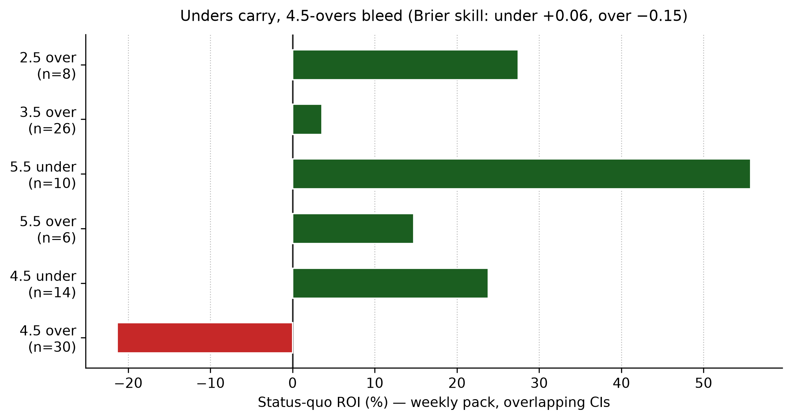
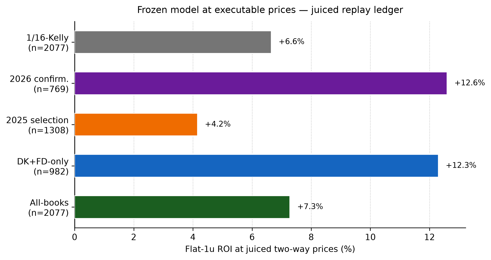
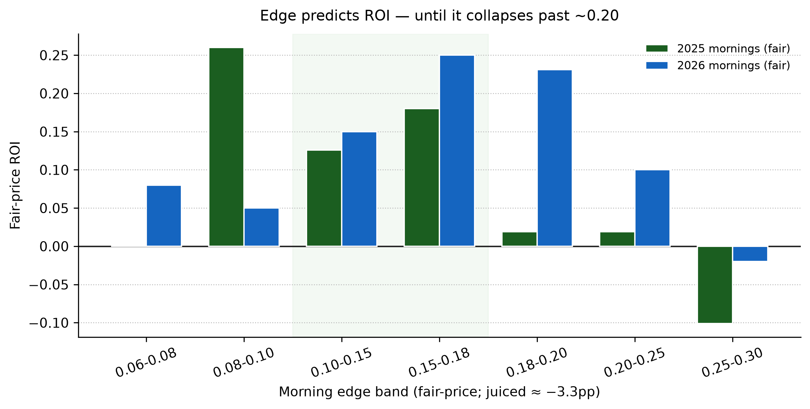
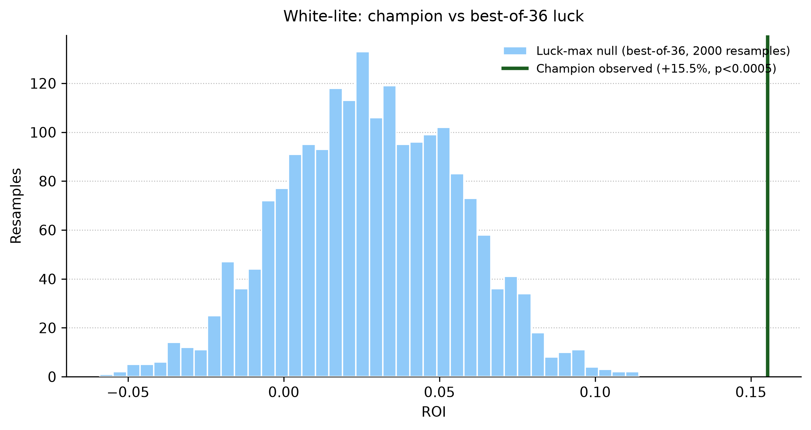
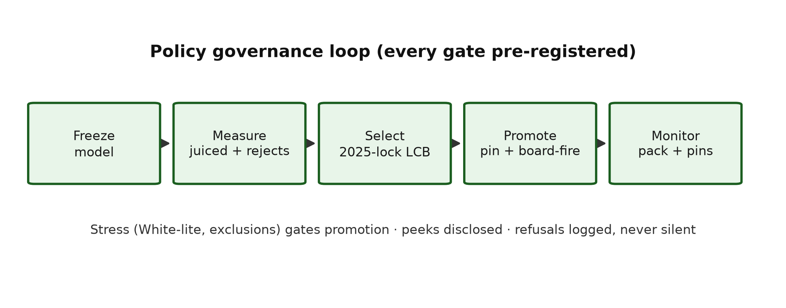

# Leakage-Safe Pregame Pitcher Strikeout Projection from Baseball Savant

**A quant ML engineering study of rate modeling, exposure projection, and governed decisioning**

Cameron Kaplinger  
Independent Researcher

*Technical manuscript · Updated 2026-09-11*

**Code repository:** [https://github.com/Cbkaplinger/MLB-Props](https://github.com/Cbkaplinger/MLB-Props)

**Acknowledgments.** Baseball Savant / Statcast pitch-level data provided the empirical foundation for this work.

---

## Abstract

This paper presents a leakage-safe **pregame** machine learning pipeline for starting-pitcher strikeout projection from Baseball Savant (Statcast) pitch-level data. The core target is game-level strikeout rate `k_rate = K / PA` for starters who face at least nine batters, using only pregame features. A Polars-first three-level pipeline builds game aggregates, lagged rolling form, and a model-ready training frame under strict chronological validation.

The active production lane uses a **two-model LightGBM blend** across frozen feature sets (`production_sparse72_monotone`, `production_final58_consensus`) with weights `0.60 / 0.40`, plus a Ridge projected-TBF companion [2]. Count projections follow `E[K] = k_rate_hat × TBF_hat`, then convert to line probabilities via **Poisson** on projected exposure (binomial retained as a one-line revert) [3, 4]. Line maps are **per-line Platt (WS1c)**, shipped 2026-09-10, replacing the August isotonic pointer.

**Statistical caution is the headline.** Trial-adjusted significance testing with the Bailey–López de Prado Deflated Sharpe Ratio [12] yields `DSR = 0.0349` on the audited `n=26` *policy-search* lane, with `PSR = 0.9701` against a zero-Sharpe benchmark. At that sample size and `N=5161` configuration search breadth, the raw Sharpe is *not* evidence of a durable post-selection edge. We report it because it diagnosed the search, not because it is a live result.

**Policy-freeze audit (2026-09-01): FAIL.** The `n=26` ROI `0.4363` / Sharpe `0.4438` / PnL `+24.17u` window spans `2026-07-30`–`2026-08-17`, entirely *before* `KING_PROFILE_AUG2026` (`2026-08-21T16:10:00Z`). Those metrics remain **pre-freeze policy-search evidence** and stay demoted (audit: `docs/reference/reports/ssac27_policy_freeze_audit_2026-09-01.md`).

**What replaced that story (measured 2026-09-11, disclosed peek).** Frozen-bundle inference on 2025–2026 regular-season starts, joined to Odds API consensus closes, gives a close-matched panel of **`n=19,533`** line-points. Live config (Poisson + WS1c) Brier `0.2204` vs book `0.2162` (skill **`−0.0043`**); ECE `0.021` vs book `0.009`; MCE `0.088` vs `0.019`. Skill is negative on all eight lines. The same starts **beat friend opens** (skill `+0.044` at ≈ −12h) and trail by morning (T−5h ≈ close). At executable juiced prices with live policy as a filter only and rejected candidates retained (`n=2,077` taken), flat-1u paper prints **+7.3%** all-books / **+12.3%** DK+FD-only (`juiced_replay_report.json`; fills unmodeled; 2026 confirmatory).

**Policy selection at scale (2025-lock, §8.9).** A 36-config family (floors × edge caps × side rules × book universes) was scored on **2025 only**; champion (floor `0.12` / cap `0.24` / under-lean / DK+FD-only) maximizes lower-confidence-bound ROI under pre-registered constraints (CLV ≥ 0, cell concentration ≤ 0.40, DK+FD sign agreement): 2025 `n=558`, ROI **`+15.5%`**, WR `0.60`, LCB **`+7.4%`**. A White-lite reality check (demeaned null, slate-clustered, 2,000 resamples) gives **p < 0.0005** — best-of-36 luck prints +2.8% typically, +7.4% at its wildest. One disclosed-peek look at 2026 repeats it (`n=485`, ROI **`+15.6%`**, LCB `+7.3%`). The champion is **promoted to live** on that evidence with the peek disclosed in writing; ≥50 real fills remain the money-truth gate, and the remainder of September is its first truly unseen ball.

Live decision policy: line floors + 4.5-over hard veto, 2.5/3.5-over probation, morning edge cap `0.24`, under-lean premium `+0.04` on overs, DK+FD-only universe, offset clip `±0.02`, 1/16-Kelly, postseason HOLD after `2026-09-27`. A same-day robust-refusal arm was measured and **reverted** (2025 −0.2% vs base +4.2% — longshot concentration). Stacker overlay stays shadow; drawdown brake stays parked.

The main contribution is an end-to-end quant workflow that links leakage-safe modeling, chronological evaluation, and governed decision operations in a reproducible system.

---

## 1. Introduction

Strikeout props are a natural target for pregame modeling: the outcome is well-defined, Statcast supplies rich pitch- and PA-level detail, and the quantity of interest separates into a **rate** component and an **exposure** component. Many published baseball analytics workflows emphasize descriptive leaderboards or postgame attribution. Betting-oriented systems often blur the pregame information set. This work treats the problem as **supervised prediction under a strict pregame constraint**.

The modeling claim is simple and compositional. A leakage-safe estimate of strikeout rate, multiplied by a leakage-safe projection of batters faced, yields expected strikeouts and line probabilities without ever using same-game outcomes as inputs:

<code>k_rate × TBF → E[K] → P(K ≥ L)</code>

**Goal.** Estimate a starter’s strikeout rate before first pitch, project how many batters that starter will face, and convert the pair into expected strikeouts and `P(K >= L)` for common prop lines `L`.

**Estimand.** Research metrics use the PA ≥ 9 cohort defined in Section 3.3.

**Figure 1.** Leakage-safe architecture. Raw Statcast pitches are aggregated into game records (Level 1), lagged rolling form (Level 2), and a model-ready training frame (Level 3). A LightGBM strikeout-rate model and a Ridge projected-TBF model combine in a count layer that yields expected strikeouts and line probabilities from projected exposure only.

### 1.1 Related work

**Sabermetric rate-based pitching models.** Fielding Independent Pitching (FIP) and related estimators such as xFIP summarize pitcher skill from strikeouts, walks, hit batsmen, and home runs (or home-run rates normalized by fly-ball environment), reducing dependence on balls in play and defensive context [7, 8]. Those metrics are primarily descriptive or talent-estimation tools at the season or large-sample level. The present work is complementary: it retains FIP/xFIP-style components as *candidate features*, but the prediction target is game-level `k_rate` under an explicit pregame information constraint, not a restatement of FIP as the forecast.

**Season-level baseball projection systems.** Systems such as Marcel [9], PECOTA [10], Steamer, and ZiPS forecast season (or rest-of-season) player rates from weighted recent performance, regression to the mean, aging, and—depending on the system—comparable-player paths. They are useful conceptual baselines for talent estimation, while this manuscript focuses on production pregame decision governance under chronological constraints.

**Chronological evaluation and leakage control.** When targets are ordered in time, randomly reshuffled cross-validation overstates accuracy by allowing future information into training folds [11]. Forecasting practice therefore prefers expanding or rolling windows and features that are known at the forecast origin. This paper treats those constraints as hard engineering rules (shifted rolling windows, prior-season park factors, date-disjoint partitions) and verifies them with tests and audits rather than as an after-the-fact caveat.

**Count models for rate × exposure.** Once a mean rate and an exposure (here, projected batters faced) are specified, Poisson or binomial probabilities are standard for count outcomes [3, 4]. Line probabilities use those trials on *projected* exposure only. A beta-binomial dispersion check collapses to the binomial limit under the frozen mean, consistent with a well-specified mean model absorbing extra-binomial variance [4].

**Governed decisioning and performance evaluation.** Reporting strategies built on small, post-selection samples are vulnerable to overstatement. The Bailey–López de Prado performance-evaluation framework—Deflated and Probabilistic Sharpe Ratios with trial-count adjustment—provides a principled way to deflate observed risk-adjusted returns for the number of configurations searched [12]. This manuscript adopts that framework (§8.2–§8.4) and complements it with market-relative skill diagnostics (Brier/LogLoss skill vs market) and closing-line-value (CLV) as decision-level evidence, consistent with practice standards that separate model accuracy from market edge.

---

## 2. Contributions

1. **Leakage-safe feature architecture.** Same-game outcomes never enter predictors; rolling statistics are shifted; park factors use prior seasons only; chronological splits never divide a calendar date across partitions.
2. **Frozen multi-set rate modeling.** The rate lane is now governed across three frozen feature sets (`sparse72`, `sparse72_monotone`, `final58`) with explicit champion/challenger workflow and artifact lineage.
3. **Dual-layer projection stack.** A weighted LightGBM ensemble for `k_rate_hat`, Ridge for projected TBF, and a count layer on projected exposure produce expected strikeouts and line probabilities.
4. **Quant governance integration.** Open-universe skill ranking vs book closes (`n=19,533`), deduped paper replay, per-line Platt (WS1c) + Poisson count layer, 4.5-over veto, and board-to-ledger parity checks are wired into the daily production decision path. Isotonic-20260821 is the documented predecessor, not the live pointer.
5. **Reproducible operations.** Policy profiles, calibration pointers, and model lineage are versioned so retraining, promotion, and daily execution are auditable.

---

## 3. Data and pipeline

Because the stack multiplies rate by exposure, both quantities must be built from the same leakage-safe information set. The pipeline below is the shared foundation for that claim (Figure 1).

### 3.1 Source

Pitch-level regular-season Statcast via Baseball Savant (local parquet cache, seasons 2015–2026 retained for coverage; **model fitting uses 2023–2024 rows**). Season 2022 supplies prior-only park and league context for 2023 boundaries and does not enter training rows. Postseason files are retained but not used in the strikeout stack documented here.

### 3.2 Three levels

**Table 1.** Three-level pipeline outputs.

| Level        | Role                                   | Primary outputs                                                     |
| ------------ | -------------------------------------- | ------------------------------------------------------------------- |
| 1 · Games    | Pitch → starter/batter game aggregates | `pitcher_games`, `batter_games`, `pitch_type_games`, `park_factors` |
| 2 · Rolling  | Leakage-safe lagged form + context     | `pitcher_rolling`, `batter_rolling`                                 |
| 3 · Training | Join lineup + park into model frame    | `pitcher_training`, `batter_training`                               |

Level 1 is the audit surface: denominators, events, and identities are defined once. Level 2 applies rolling and season-to-date windows with an explicit lag so the game being predicted never contributes to its own features. Level 3 assembles opponent-lineup aggregates and prior-season park factors.

Implementation is Polars-first, with automated tests for feature safety, pipeline stages, and the trainer/splitter. Repository paths and artifact names are collected in Appendix A.

### 3.3 Population filter

Default research rows require PA ≥ 9. This is a **postgame** cohort definition for a **pregame** model: it does not leak feature values, but it conditions every reported metric. Population audits show excluded share ≈ **3.5%** (2023–2024). Cutoffs 8–10 change exclusion by about half a percentage point; nine remains the frozen policy.

---

## 4. Leakage methodology

Leakage control is not a preamble to the rate × exposure claim—it is what makes the claim scientifically meaningful. If same-game outcomes contaminate features, both the rate model and the TBF model become postgame reconstructions rather than pregame forecasts.

The following rules are treated as hard constraints:

- Same-game K, PA, Outs, and `k_rate` are labels / evaluation fields only.
- Rolling and season-to-date player statistics are shifted by one game or start.
- Season-to-date windows reset at season boundaries.
- Park factors for season Y use only seasons before Y.
- Opponent lineup aggregates use each batter’s **pregame** form; historical membership is the first nine distinct batters by first PA.
- Train / validation / test splits are chronological; a calendar date lies in exactly one partition.
- Unexpected numeric columns are rejected unless they match approved pregame naming rules.

Verification combines notebook spot checks (first start of season, season boundary resets, manual rolling recomputation) with an automated test suite. Process bugs (for example relocated-park blending; Section 9) were logged with before/after evidence in the research log.

**Evaluation scope.** Development metrics use 2023–2024 chronological partitions and nested folds. Any 2025 reporting is treated as non-selection context rather than a pristine post-freeze holdout.

---

## 5. Feature design

With the information set fixed, feature design is treated as a quant selection problem: keep only pregame signals that survive chronological evaluation and operational governance checks.

### 5.1 Active feature sets

The rate lane is maintained through three frozen sets:

- `production_sparse72` (compact baseline),
- `production_sparse72_monotone` (same sparse spine with monotone constraints),
- `production_final58_consensus` (consensus-pruned compact set).

These sets are evaluated both as individual models and as ensemble members.

### 5.2 Monotone-constraint implementation scope

Monotone constraints are implemented in the LightGBM production lane because that path is hardened in the current training/evaluation stack [1]. XGBoost also supports monotonic constraints, and Aug 2026 parity runs include explicit constrained-vs-unconstrained XGBoost comparisons.

### 5.3 Model selection criteria

Production promotion decisions are driven by:

1. feature-level pruning outcomes on frozen sparse sets,
2. rolling-window sensitivity checks,
3. out-of-sample market-skill governance lanes (open and deduped manual),
4. deployment robustness (calibration transfer and parity checks).

Family ablation serves as a challenger screen, while production promotion is determined in the governance lane.

### 5.4 Empirical-Bayes style shrinkage in features

The production feature pipeline uses empirical-Bayes style shrinkage selectively to stabilize low-sample pregame rates:

- `src/Python/batter_rolling.py`: batter rolling K% shrinkage (`k_rate_std_shrunk`) toward batter prior + league prior with pseudo-PA strength.
- `src/Python/pitcher_rolling.py`: prior-season shrunk pitcher K/PA (`add_prior_season_shrunk_k`) and low-sample pitch-type shrinkage toward prior-date league means.
- `src/Python/pitcher_features.py`: league HR/FB prior smoothing (`lg_hr_fb_prior`) with explicit prior-strength blending.

This gives cold-start and small-sample rows a stable prior-date fallback while preserving leakage safety (no same-game outcomes in predictors).

---

## 6. Models

Feature design supplies the inputs; models convert those inputs into rate and exposure, then into count probabilities.

### 6.1 Strikeout-rate lane

**Table 2.** Active rate-model structure.

| Component | Role |
| --- | --- |
| LightGBM (`sparse72_monotone`) | Ensemble member with monotone constraints |
| LightGBM (`final58`) | Ensemble member |
| Active blend (`0.60 / 0.40`) | Active production scorer (`sparse72_monotone`, `final58`) |

The production decision is not a single-model claim; it is a governed ensemble
choice validated across open-universe and deduped-manual lanes.

**Table 2a.** Current contender `k_rate` MAE (model-family lane, sparse-set run).

Table 2a is a challenger-screen table for single-model error behavior on shared sparse feature sets; it is not the deployment champion table.

| Rank | Model family | Feature set | Mean `k_rate` MAE |
| --- | --- | --- | ---: |
| 1 | ridge | `production_sparse72` | 0.07668 |
| 1 (tie) | ridge | `production_sparse72_monotone` | 0.07668 |
| 3 | lightgbm | `production_sparse72_monotone` | 0.07669 |
| 4 | lightgbm | `production_sparse72` | 0.07707 |
| 5 | histgbr | `production_sparse72` | 0.07721 |

**Table 2b.** Chronological game-level naive baselines (Marcel lane; **not** the Table 2a outer-fold protocol).

| Baseline | Test `k_rate` MAE | n | Notes |
| --- | ---: | ---: | --- |
| Marcel (3/2/1 + EB regress, no age) | 0.08257 | 1413 | `marcel_baseline.py` |
| Prior-season only | 0.08301 | 1413 | same split |
| Train-mean | 0.08538 | 1413 | same split |
| Frozen LightGBM (registry freeze ref.) | ≈0.0787 | — | same test start; not re-fit here |

Delta over Marcel for the freeze reference: ≈ **−0.0039** absolute MAE. Sparse72 ridge **0.07668** (Table 2a) cannot be subtracted from Marcel without fold-aligned preds — different evaluation contract. Source: `docs/reference/reports/ssac27_naive_mae_baseline_2026-09-01.md`.

The current ensemble-sweep ranking artifact does **not** include `k_rate` MAE
columns; it is ranked on decision metrics (ROI/risk/market-skill). Therefore,
ensemble `k_rate` MAE is reported as **not available in that artifact lane**.
Also, family-model tags in this lane reflect a mixed budget (some default configs,
some small inner-fold tuning), so rankings should be read as practical challenger
screens rather than a perfectly equal hyperparameter-budget bakeoff.

Why Ridge can rank first in Table 2a and not be the deployment champion:

1. Table 2a is a **single-model `k_rate` error lane**.
2. Deployment championing is a **full decision lane** (`k_rate × TBF → P(K ≥ L)` with market-skill and risk metrics).
3. A tiny `k_rate` MAE edge does not guarantee better calibrated line probabilities or better realized risk-adjusted return after exposure, pricing, and bet-selection gates.

**Note: Why ensemble over single model (paper/interview short form)**

- **Single model = best point forecaster** in chronological MAE lanes.
- **Ensemble = best deployable decision engine** after calibration + market/risk governance.
- The project selects single-model leaders for challenger tracking and model-quality reference.
- The project selects deployment champions on decision metrics (skill vs market, ROI, Sharpe/Sortino, drawdown, CLV behavior).
- Therefore, “best MAE model” and “best deployed profile” can differ without contradiction.

### 6.2 Projected batters faced (TBF)

Rate alone is not a strikeout count. The second factor is projected batters faced: same-game PA is used only as a historical exposure oracle for training and evaluation, never as a predictor. Predictors include rest, lagged PA / Outs / Pitches, home/park/lineup K context, and thin team bullpen L1–L3d pitch/pitcher-use lookbacks (**24** features).

**Frozen choice:** Ridge with the thin bullpen feature set (coefficients persisted for reproducible scoring).

### 6.3 Count layer

The count layer is where rate and exposure become the paper’s target quantities, following the standard mean × exposure construction for count probabilities [3, 4]:

<code>E[K] = k_rate_hat × TBF_hat</code>

P(K ≥ L) via Poisson with n = round(TBF_hat) (live default as of 2026-09-10; binomial is a one-line revert in `src/Python/count_layer.py`)

Same-game PA never enters prop probabilities. A 2026-09-09 same-subset race on the close-matched universe preferred Poisson on 7/8 lines; that is why production swapped the family, not a search-lane ROI.

Notation used throughout Sections 6–8 is: model probability (`p_model`), de-vig market probability (`p_market`), edge (`p_model − p_market`), expected strikeouts (`Ê[K]`), and CLV in probability points (`CLV_pp`).

The production evaluation emphasis is now decision-lane quality (market-skill, replay ROI/risk path, and deployment robustness) rather than legacy internal MAE tables alone.

---

## 7. Ablations and feature-set freeze

The ablation framework now has two jobs: (a) quantify single-model sensitivity, and (b) provide candidate inputs for the ensemble governance lane.

### 7.1 Current protocol

- Outer chronology: anchored walk-forward windows.
- Inner chronology: model/feature tuning only inside training spans.
- Final rank surface: open-universe skill first, then deduped one-opportunity manual replay, then deployment checks.

### 7.2 Current takeaway

Current decisions are made on compact frozen sets (`sparse72_monotone`, `final58`) and their weighted ensemble behavior.

### 7.3 XGBoost monotone in the promotion workflow

XGBoost monotonic constraints were evaluated in follow-up parity runs against the hardened LightGBM monotone path (constraint mapping, validation, artifact lineage). Promoting an XGBoost-monotone lane would require its own constraint-sign audit and equal governance contract. Verdict: **tested as a challenger, did not clear the sparse-lane bar** — unconstrained (`expected_K` MAE `1.8451`) and monotone (`1.8511`) both trailed LightGBM and Ridge at base budget, and tuned-small variants (`~1.8242` / `~1.8352`) stayed behind with Ridge the MAE leader. The decision-lane bridge confirmed MAE rank does not map one-to-one to market/risk profile. Detail: parity snapshots in Appendix A.5.

---

## 8. Full-stack evaluation

Component metrics are necessary but incomplete. Once rate and TBF are frozen, the object that must be judged is the full composition:

<code>k_rate × TBF → E[K] → P(K ≥ L)</code>

**Table 3.** Full-stack evaluation gates and current production results.

| Evaluation gate | Result |
| --- | --- |
| Active deployment blend (frozen `2026-08-21`) | `0.60 sparse72_monotone / 0.40 final58` |
| Policy-search ROI (`n=26`, pre-freeze; **not OOS**) | `0.4363` (95% CI `[0.0337, 0.8072]`) |
| Policy-search PnL (same lane; **not OOS**) | `+24.17u` (`1u = 50 USD`) (95% CI `[+1.85u, +45.45u]`) |
| Policy-search Sharpe (same lane; **not OOS**) | `0.4438` (95% CI `[0.0431, 0.9997]`) |
| Policy-search Sortino (same lane; **not OOS**) | `0.4277` (95% CI `[0.0459, 0.7866]`) |
| Policy-search Calmar (same lane; **not OOS**) | `2.2903` |
| Policy-search max drawdown (same lane; **not OOS**) | `0.1905` |
| Market-skill deltas (search window) | `+0.2069` Brier skill vs market, `+0.1551` LogLoss skill vs market |
| Probability quality (search-window profile) | Brier `0.2090`, LogLoss `0.6087`, ECE `0.0639`, MCE `0.1353` — *pre-freeze 26-bet manual search lane, post-isotonic-transfer fit, `n=26`; not live quality* |
| Universe close skill (live config, 2026-09-10) | Brier us `0.2204` / book `0.2162` (skill **`−0.0043`**); ECE `0.021` / `0.009`; MCE `0.088` / `0.019` on `n=19,533` close-matched line-points (`rescore_cal_report.json`). Not a betting-edge claim. |
| Paper money track (deduped, through 2026-09-09) | `n=973` props, PnL `+$611`, mean CLV `+0.59`pp on `n_clv=545` — paper prices, not fills |
| Execution controls | Board-to-ledger parity lock, quality gates, policy profile freeze `KING_PROFILE_AUG2026`; live overlays: 4.5-over veto, 2.5/3.5 probation floor `0.18`, Poisson count layer, WS1c Platt pointer, postseason HOLD after `2026-09-27` |

*Bootstrap 95% CIs (10,000 resamples) on the decision metrics are the pinned values in `artifacts/odds_log/quant_honesty_aug21_summary.json`; full intervals including the date-block bootstrap are reported in §8.2. Calmar has no interval in that artifact and is shown as a point estimate. **Policy-freeze audit 2026-09-01:** slate dates for this lane are `2026-07-30`–`2026-08-17` (all before freeze); ROI/Sharpe/PnL are policy-search diagnostics only (`docs/reference/reports/ssac27_policy_freeze_audit_2026-09-01.md`).*

Calibration is summarized by expected calibration and scoring diagnostics [5, 6]. On the pre-freeze search window the profile reports ECE `0.0639`, MCE `0.1353`, and positive market-skill deltas versus market baseline; these remain search-window diagnostics, not post-freeze proof of edge.

### 8.1 Metric hierarchy used in this manuscript

- `k_rate` MAE: single-model rate accuracy lane.
- `expected_K` MAE: full-stack point-forecast lane (`k_rate_hat × TBF_hat`).
- Brier/LogLoss skill vs market and ROI/risk metrics: deployment-governance lane.

Each lane answers a different question; winners are not interchangeable across lanes.

### 8.2 Backtest uncertainty and multiple-testing correction (pre-freeze 26-bet policy-search lane)

The audited manual lane contains `n=26` graded recommendations (`top3`, floor `0.12`) with slate dates `2026-07-30`–`2026-08-17` — entirely before the `2026-08-21` freeze. **Policy-freeze audit 2026-09-01: FAIL.** ROI `0.4363` (95% CI `[0.0337, 0.8072]`), Sharpe `0.4438` (`[0.0431, 0.9997]`), Sortino `0.4277`, PnL `+24.17u` are policy-search evidence, not OOS evaluation; trial-adjusted DSR is `0.0349` on `N=5161` blend×floor configs (PSR `0.9701` vs zero Sharpe). This lane diagnosed the search; §8.2.3 is its evidentiary replacement. Point estimates: `open_top3_transfer_manual_replay_aug21_deduped_top3_from_dedupedsweep.json`; CIs: `quant_honesty_aug21_summary.json`; enumeration: `ssac27_n5161_enumeration_2026-09-01.md`; audit: `ssac27_policy_freeze_audit_2026-09-01.md`.

### 8.2.1 Post-freeze KING-floor lane (honest OOS replacement, through 2026-08-31)

After the FAIL freeze audit, the only epistemically valid money lane is **post-freeze** under the locked profile. Extracted from the deduped settled ledger with `game_date > 2026-08-21` and `passes_floor == True` (live dual-ensemble gate; stake &gt; 0):

| Lane | n | ROI | Win rate | CLV mean (pp) | CLV &gt;0 (n) | Span |
| --- | ---: | ---: | ---: | ---: | ---: | --- |
| Post-freeze KING floor | 74 | −0.0155 | 0.486 | +0.0159 | 0.586 (29) | 2026-08-22–08-31 |
| · overs only | 45 | −0.2464 | 0.378 | +0.0058 | 0.632 (19) | same |
| · unders only | 29 | +0.2933 | 0.655 | +0.0351 | 0.500 (10) | same |

Source: `docs/reference/reports/postfreeze_king_profile_metrics_2026-09-01.md`. Interpretation: sample size is improved vs the demoted n=26 search lane but still below DSR power targets; aggregate ROI is slightly negative; side asymmetry is first-order. **Do not treat this table as a claimed edge.**

### 8.2.2 Null / placebo decision lanes (post-freeze)

Matched nulls vs the locked KING floor (`0.12`) on post-freeze settled opportunities (`game_date > 2026-08-21`), produced by `production/ops/run_null_decision_lane.py`:

| Lane | n | ROI | Win rate | CLV mean (pp) | CLV &gt;0 |
| --- | ---: | ---: | ---: | ---: | ---: |
| KING `passes_floor` | 74 | −0.0155 | 0.486 | +0.0159 | 0.586 |
| Random-prob (matched n/floor) | 74 | −0.0917 | 0.459 | +0.0108 | 0.464 |
| Naive-prior (matched n/floor) | 74 | −0.0562 | 0.473 | +0.0112 | 0.474 |
| Shuffle-edge on KING set | 56 | −0.0256 | 0.482 | +0.0203 | 0.600 |

Report: `docs/reference/reports/ssac27_null_decision_lane_2026-09-01.md`. Random/naive may impute stake on non-bet ledger candidates and are **null references**, not production policies. KING is less red than the matched nulls and posts a higher beat-close share than random/naive, but absolute ROI remains negative and margins are not DSR-grade — consistent with the demoted n=26 / weak DSR posture. **No decision-layer edge claim.** These nulls are **illustrative diagnostics only** (stake imputation + crude priors); they are not a validated placebo control for abstract claims.

**Interim ops (2026-09-01; live veto promoted same day).** Post-freeze side×line bleed is first-order (esp. 4.5 overs). Shadow counterfactuals on real KING stakes (`production/ops/run_shadow_asymmetric_policy.py`) showed vetoing 4.5 overs moving the post-freeze floor set from ROI ≈ −1.55% (n=74) to ≈ +8.3% (n=56); raising the over floor to 0.16 (shadow) was also green on that window. Brier skill vs market is **negative on overs** and **positive on unders**. The **4.5-over hard veto** (plus soft probation on 2.5/3.5 overs) was **promoted to live** on 2026-09-01 (`docs/reference/reports/live_policy_promotion_2026-09-01.md`). This is **risk control**, not a claimed durable edge. Do not retune the veto from later 2026 paper windows — that sample already selected it. The asymmetry persists at every scale measured since (weekly Brier skill under `+0.06` vs over `−0.15`; Fig. 8).

**Figure 8.** Status-quo line×side ROI: unders carry, 4.5-overs bleed (point-in-time weekly pack; CIs overlap — risk control, not proof).

### 8.2.3 Current measurement (2026-09-11; champion promoted with disclosure)

The n=74 KING-floor table above is the honest *through-August-31* replacement for the demoted n=26 search lane. The replay era supersedes it at universe scale — same frozen probabilities, executable prices, rejected candidates retained.

| Scope | n | What it measures | Result |
| --- | ---: | --- | --- |
| Universe close, live Poisson + WS1c | 19,533 | Skill vs Odds API consensus close | Brier 0.2204 vs book 0.2162 (skill −0.0043); ECE 0.021 vs 0.009; MCE 0.088 vs 0.019. Skill negative on all eight lines. |
| Same starts vs friend open | 7,986 | Timing | Skill **+0.044** at ≈ −12h; ~0 by T−5h morning |
| Juiced replay, flat 1u (Fig. 5) | 2,077 | Frozen probs at juiced prices, live policy as filter | ROI **+7.3%**, WR 0.506, CLV +1.08pp; DK+FD-only +12.3% (n=982); 2025 +4.2% / 2026 +12.6% confirmatory; 1/16-Kelly +6.6%. Fills unmodeled. |
| Morning edge bands (Fig. 6) | bins | Where edge predicts ROI | Green band 0.08–0.18 fair (≈ 0.05–0.15 juiced); collapse past ~0.20 both years — extreme disagreement means we are wrong, not bold |
| 2025-lock selection (Fig. 7) | 558 | Pre-registered 36-config family, 2025 only | Champion (floor 0.12 / cap 0.24 / under-lean / DK+FD): ROI **+15.5%**, WR 0.60, LCB **+7.4%**, CLV +1.24pp; White-lite p<0.0005; exclusions ≥+12.9%; September slice +22.0% |
| Disclosed-peek 2026 judge | 485 | Same champion, one look | ROI **+15.6%**, WR 0.60, LCB +7.3%, CLV +1.30 — repeats. Labeled peek, not clean. |
| Slate correlation | 2,019 | Featured totals joined to taken tickets | 533 games carry 2+ tickets (1,633 correlated pairs); high-total (≥9.5) split +21.5% vs +4.2% rest — descriptive, caps unbuilt |
| Deduped paper ledger (36 days, `paper_quant_report.json`) | 317 | Paper PnL / CLV, not fills | PnL +$611 (+2.7% ROI); mean CLV +0.75pp on 195 CLV rows; veto lane +6.5% (n=258) |
| Weekly veto pack (point-in-time) | 95 | Live 4.5-over veto on paper | ROI +14.3% vs status-quo +7.2% (CIs overlap — risk control, not proven edge) |

Sources: `artifacts/odds_log/rescore_cal_report.json`, `universe_panel_live.parquet`, `juiced_replay_report.json`, `select_2025_report.json`, `slate_shock_report.json`, weekly pack `docs/reference/reports/weekly_policy_settle_pack_latest.md`. Live work-state: `docs/EXECUTION_BACKLOG.md`.

**Figure 5.** Flat-1u juiced ROI by slice (frozen probs, live policy as filter, rejected rows kept).

**Figure 6.** Morning edge-band ROI hump (fair-price mornings; juiced ≈ −3.3pp). The green band is the durable core; the cliff past ~0.20 is the edge-cap's evidence.

**Figure 7.** White-lite null (best-of-36 luck, demeaned, slate-clustered) vs observed champion +15.5%.

### 8.3 Slippage sensitivity (fixed 26-bet policy-search set, retired lane)

Adverse fill haircuts (0–2.0pp) applied to the same 26-bet audited set, no re-selection: ROI compresses `0.4363 → 0.4163`, Sharpe `0.4352 → 0.4148` — positive throughout, compressing as expected. Full grid: `artifacts/odds_log/slippage_sensitivity_top3_floor12_aug21.csv` (self-consistent Sharpe series from `0.4352`; the `0.4438` deployment Sharpe comes from the re-audited replay JSON — lineage: `docs/reference/reports/ssac27_honesty_slippage_lineage_2026-09-01.md`). Retained as execution-fragility evidence on a retired lane, not a live claim.

### 8.4 Sample-size plan (superseded method, retained for lineage)

The DSR power targets below (`n ≈ 98` for DSR>0.5, `n ≈ 147` for DSR>0.8) belong to the retired n=26 blend-search lane and are **not** the current selection gate. The 2025-lock uses slate-clustered LCB with White-lite confirmation instead (§8.8). Retained so the DSR numbers cited in §8.2 stay interpretable:

- `n ≈ 98` bets to reach `DSR > 0.5`, `n ≈ 147` for `DSR > 0.8` (holding return-shape moments and trial count fixed; ~72–121 recommendations beyond the old audited set at then-density).

Metric-purpose rule used in this manuscript (unchanged):

- MAE/RMSE/R² claims come from chronological model-evaluation lanes (2023–2024 walk-forward/CV and 2025 holdout protocol).
- Open 2025–2026 and manual replay lanes are used for market/decision metrics (Brier/LogLoss skill vs market, ROI, Sharpe, Sortino, drawdown, CLV), not MAE promotion claims.

**Figure 2.** Reliability diagram for count-layer line probabilities. Points near the diagonal indicate well-calibrated bins. Mean ECE ≈ 0.024 with no post-hoc recalibration — **pre-deployment walk-forward 2024 diagnostic only** (`artifacts/model_quality/phase11c_calibration/`, `n=4607` rows across 3 chronological windows, `ece_mean=0.0243`, `ece_max=0.0403`; raw probabilities, no isotonic transfer applied).

> **Lane clarification (three ECE numbers, not two).** These values are *not*
> comparable and must not be conflated:
> - **ECE ≈ 0.024** (here and in Fig. 2) is the broad **pre-deployment walk-forward
>   2024 diagnostic** across `n=4607` raw predictions / 3 windows — internal stack
>   check, not a deployed-lane claim.
> - **ECE 0.0639 / MCE 0.1353** (Table 3 / A.5) is the **pre-freeze 26-bet search
>   lane** after isotonic transfer. Small-sample realization — not live quality.
> - **ECE 0.021 / MCE 0.088** (live Poisson + WS1c, close-matched `n=19,533`) is the
>   current universe measurement vs book ECE `0.009` / MCE `0.019`
>   (`rescore_cal_report.json`). This is the number to cite for production
>   probability quality. It is still worse than the book; ships closed ~27% of the
>   prior frozen-config gap.

These checks are confirmatory: they did not uncover large unused gains on the frozen stack’s internal metrics.

---

### 8.5 Production governance state (2026-09-11)

Current live operations use a compact three-lane governance model:

1. **Skill lane (open universe):** rank candidates on market-skill metrics vs Odds API consensus closes (`n=19,533` close-matched).
2. **Decision lane (paper, deduped):** one-opportunity-one-bet fairness on the SharpAPI paper ledger; not fills.
3. **Deployment lane:** frozen blend + shipped overlays, fail-closed on parity/quality gates.

**Live as of 2026-09-11** (code, not notes — champion promoted, peek disclosed):

- profile lock: `KING_PROFILE_AUG2026` (`frozen_utc=2026-08-21T16:10:00Z`),
- edge floor: `0.12` juiced with line-aware side floors (map in `line_floor_policy.json`),
- morning edge cap `0.24` (`edge_cap` HOLD — refusals logged, not silently dropped),
- under-lean premium `+0.04` on overs (`below_lean_floor` skip),
- DK+FD-only fill universe (live SharpAPI carries only DK/FD; enforced as a guard),
- **Poisson** count family (`COUNT_LAYER_FAMILY_DEFAULT`),
- **WS1c per-line Platt** pointer `prob_calibration_ws1c_platt_20260910_012559` (isotonic-20260821 is the predecessor backup),
- 4.5-over hard veto; 2.5/3.5-over probation floor `0.18` (2.5-over now de-facto banned where floor 0.20 meets cap — documented intentional on n=18, −4.9%),
- segmented line/price/maturity correction overlays clipped at **±0.02** (shipped 2026-09-11; silent shaping visible via offset columns),
- 1/16-Kelly sizing (`DEFAULT_KELLY_FRACTION = 0.0625`; flat 1u stays the research benchmark and beats Kelly on paper ROI everywhere),
- postseason HOLD after `season.regular_end=2026-09-27`,
- deploy-matrix filter (11/13 segments confirmed; full-universe re-gate scheduled with the next locked evaluation),
- board-to-ledger parity reconciliation before governance status; regression pin fails on any unapproved drift (`tests/test_live_stack_pin.py`, 345+ green).

**Measured and reverted same day:** robust-refusal arm (2025 −0.2% vs base +4.2% — plus-price longshot concentration, refused set still +6.2%). Code retained fail-open for the October family dimension.

**Researched, not live:** distill stacker overlay (shadow only; market-following compresses edge — ROI effect unmeasured), drawdown-brake multiplier ×0.5 (parked by owner order: follow the edge). Each needs an explicit go; none of them is implied by this manuscript update.

Failure-mode behavior: if parity or quality gates fail, the promotion path is fail-closed (no automatic profile promotion) until reconciliation and gate re-clearance.

**Deployment vignette (2026-09-11, one ticket through the whole stack).** Morning board: Blake Snell under 7.5, FanDuel −130, expected K 5.80, model edge 19.3%, sized 1.47u ($73.48) at 1/16-Kelly. The ticket clears every layer visibly: line floor 0.12 (7.5), no veto (under), no probation (not 2.5/3.5-over), edge under the 0.24 cap, no lean premium (under), DK/FD book, TBF gate, deploy segment on. The same morning it was first scored at 21.5% edge — held by the interim 0.20 cap at the midday rerun, then bet under the promoted 0.24 cap as the price moved to −130. One ticket, every gate legible, policy version reconstructible from raw JSON + frozen hashes.

**Historical artifact-backed search winners (pre-freeze; not current production quality)**

- **Open-universe deduped sweep top profile:** `0.05 sparse72 / 0.45 sparse72_monotone / 0.50 final58`  
  ROI `0.6612`, Sharpe `0.9468`, Sortino `0.6954`, skill deltas `+0.0825` Brier / `+0.0645` LogLoss.
- **Active deployment champion (deduped transfer lane, n=26 search):** `0.60 sparse72_monotone / 0.40 final58`  
  ROI `0.4363`, PnL `+24.17u` (`1u = 50 USD`), Sharpe `0.4438`, Sortino `0.4277`, max drawdown `0.1905`, skill deltas `+0.2069` Brier / `+0.1551` LogLoss.

Those n=26 numbers diagnosed the search. Current measurement is §8.2.3.

Execution note: paper replay metrics assume fills at recorded replay prices. Real-ticket money truth remains gated on ≥50 logged fills.

**Larger settled-threshold view (operational diagnostic; mixed pre/post-freeze).**  
To calibrate floor behavior on a broader operations sample, settled positive-stake rows from `2026-07-31` forward were bucketed by policy floor. This window **includes both pre-freeze and post-freeze days** and is an execution-policy diagnostic (volume/ROI tradeoff), **not** a pure post-freeze OOS claim and not a replacement for either the demoted 26-bet search lane or the §8.2.1 KING-floor post-freeze lane.

| Policy | Bets (`n`) | ROI |
| --- | ---: | ---: |
| Single floor `0.08` | `277` | `0.0182` |
| Single floor `0.10` | `248` | `0.0331` |
| Single floor `0.12` | `222` | `0.0710` |
| Single floor `0.14` | `175` | `0.0482` |
| Single floor `0.16` | `127` | `0.0859` |
| Dual floor (`over=0.10`, `under=0.08`) | `263` | `0.0281` |

> **Freshness note (2026-09-01).** The counts above are the *post-dedupe* operational bucketing of settled positive-stake rows from `2026-07-31` forward, drawn from the regenerable `artifacts/odds_log/runtime_floor_calibration.csv` (regenerated with the morning monitoring snapshot). Earlier manuscript revisions reported inflated raw-row counts (`307/285/265/209/159/299`), then an Aug-27 deduped snapshot (`233/214/193/153/112/225`); the live deduped ledger now yields the `n` above. Because these counts roll forward as the ledger settles, this table is a point-in-time operational snapshot — not a frozen evaluation claim.

Interpretation: higher floors still cut volume; ROI is not strictly monotone in floor (the `0.14` bucket dips vs `0.12`/`0.16` in this window). This table is a **2026-09-01 operational snapshot** and is not the current policy-selection set (ledger is money-track only after 2026-09-10). Live juiced floor `0.12` sits at the back of the later 0.08–0.18 fair-edge band (≈ 0.05–0.15 juiced); do not retune it from this mixed window.

Working hypothesis for edge persistence: strikeout-prop markets are thinner and adjust less uniformly than major side/total markets, so leakage-safe pitcher-form and lineup-context features can remain underpriced at some times of day. This is a practical market-microstructure hypothesis, not a proof of persistent inefficiency.

**Figure 3.** Cumulative PnL overlay for `top3` vs `top1` at floor `0.12` (`1u = 50 USD`). **Lane:** Aug-21 transfer picks / policy-search window (not post-freeze OOS). **n:** top3 = 26, top1 = 27. **Date span:** `2026-07-30`–`2026-08-17` on the pinned picks CSV. **Generator:** `docs/paper/make_figures.py` → `fig_equity_top3_vs_top1()` from `artifacts/odds_log/open_top3_transfer_bestfloor_picks_aug21_deduped_top3_from_dedupedsweep.csv` (`pnl_u = stake × rpd / 50`). Bootstrap CIs for the top3 lane’s ROI/Sharpe are in `quant_honesty_aug21_summary.json` (§8.2); the figure itself is a path overlay, not a CI ribbon. Headline Sharpe/DD/Calmar for this lane follow the authoritative replay JSON (0.4438 / 0.1905 / 2.2903); honesty/slippage artifacts retain pre-correction baseline Sharpe 0.4352 by intentional freeze — see `docs/reference/reports/ssac27_honesty_slippage_lineage_2026-09-01.md`.

---

### 8.6 Interpretability and model-driver evidence (artifact-backed)

Interpretability is handled here as **stable directional evidence** from leakage-safe ablations and challenger parity runs, rather than as one-off global importance ranks.

Primary evidence used in this manuscript:

- nested family/window ablation records (`docs/research/historical-step-findings-summary.md` and linked `artifacts/feature_research/*ablation*` outputs),
- sparse-lane model-family parity artifacts (`artifacts/model_quality/sparse72_model_family_ablation/aug21_parity_base/` and `aug21_parity_tuned_small/`),
- governance-lane bridge artifacts (`artifacts/odds_log/model_family_governance_compare_aug21_governance_base.csv` and `..._tuned_small.csv`).

Driver-level interpretation used for interviews and operational review:

- **Point-forecast lane:** Ridge remains the best single-model MAE challenger (`expected_K` MAE about `1.7621`, `k_rate` MAE about `0.07668`) on the sparse-lane parity contract.
- **Monotone-rate lane:** LightGBM monotone remains in the near-frontier cluster (for example `expected_K` MAE about `1.7689` in base-budget parity) while preserving the production monotone policy path.
- **Challenger variation:** XGBoost was evaluated in both unconstrained and monotone forms; both trailed current sparse-lane leaders in this cycle (tuned-small examples: about `1.8242` unconstrained and `1.8352` monotone `expected_K` MAE).
- **Deployment implication:** MAE rank and deployment rank diverge by design; governance winners are selected on market-skill and risk metrics, not MAE alone.

### 8.7 Start-level case narratives (audited 26-bet lane)

The narrative cases in this section are **explicitly illustrative and anecdotal**: `n=3` individual starts are presented to convey decision behavior, not to support any statistical claim. No directional inference for the lane's edge should be drawn from them; the aggregate evidence is governed by §8.2–§8.4.

The audited lane (`top3`, floor `0.12`) contains both high-edge confirmations and misses. The purpose of these examples is to show **decision behavior under uncertainty**, not to re-argue MAE.

- **Right-call example (high edge, under):** 2026-07-31 `Paul Skenes` under `7.5` (`edge=0.2742`) settled as a win (`rpd=+1.10`, positive CLV).
- **Right-call example (high edge, over):** 2026-07-30 `Roki Sasaki` over `5.5` (`edge=0.2293`) settled as a win (`rpd=+1.00`).
- **Wrong-call example (high edge, under):** 2026-08-15 `Ian Seymour` under `6.5` (`edge=0.2292`) settled as a loss (`rpd=-1.00`) despite positive pre-bet edge and positive CLV.

These cases illustrate the practical pattern seen across the lane: edge/CLV signal can be directionally useful while individual outcomes remain noisy at start level.

### 8.8 Policy selection at scale: the 2026-09-11 lock

The fair-price harness (§8.2.3, since retired as folklore) searched 56 configs on fair probs and peeked 2026 twice. Its replacement is a juiced, pre-registered, once-only design:

1. **Family** (locked before running): uniform floors {0.08, 0.10, 0.12} × edge caps {0.18, 0.20, 0.24} × side rules {both, under-lean +0.04} × book universes {next-book, DK+FD-only} = 36 configs. Veto and probation stand outside the search. Full spec: `docs/reference/reports/policy_reset_2025lock_prereg_2026-09-11.md`.
2. **Selection on 2025 only** (`n=10,487` candidates): champion = max LCB_95(ROI) on slate-clustered block bootstrap subject to CLV ≥ 0, no line×side cell over 40% of PnL, DK+FD sign agreement, n ≥ 200. In-memory filtering is exact (rejected rows carry full pricing; acceptance is monotone) and economics route through the canonical money function — a hand-rolled payout caught overpaying short-price winners mid-build is documented in the selection log.
3. **Stress before promotion:** White-lite p<0.0005 (demeaned null, slate-clustered, 2,000 resamples; White [13]); worst cell/month exclusions ≥+12.9%; September slice +22.0%.
4. **One disclosed-peek judge on 2026**, then promotion with the peek in writing.

Result: floor `0.12` / cap `0.24` / under-lean / DK+FD-only, 2025 ROI +15.5% → 2026 +15.6%, live since 2026-09-11. The largest lever is book choice, not probability — reported as a finding, not a footnote.

**Figure 9.** Policy governance loop. Every gate is pre-registered; stress stands between selection and promotion.

### 8.9 Operational benchmark snapshot (local workstation)

To make the MLE-facing reliability claims auditable, this manuscript records concrete runtime slices from the parity and governance workflow used in the Aug 2026 checkpoint:

- sparse-lane base parity run (`ablate_sparse72_model_families.py`): about `234s`,
- sparse-lane tuned-small parity run: about `797s`,
- governance bridge run (`compare_model_family_governance.py`, base): about `120s`,
- governance bridge run (tuned-small): about `235s`.

End-to-end parity-plus-governance refresh for that checkpoint was about **23 minutes** wall-clock on the local workstation.

Operational controls remain fail-closed: if parity/quality gates fail, promotion does not proceed until reconciliation clears (`production/ops/build_validation_ops_report.py`, `production/ops/build_policy_governance_report.py`).

---

## 9. Limitations

**Population scope.** Reported core metrics use the PA ≥ 9 cohort and therefore describe conventional-length starts.

**Game-level variance ceiling.** Even with modern features and ensemble blending, pitcher-game outcomes retain substantial irreducible variance.

**Exogenous signal coverage.** Some high-impact context channels (weather micro-effects, travel fatigue, umpire framing) remain outside the frozen production feature set.

**Statistical confidence.** The n=26 search lane that motivated the DSR analysis is retired as evidence; current inference rests on the juiced taken set (`n=2,077`), the 2025 selection slice (`n=558` champion), and the universe panel (`n=19,533`). Trial-adjusted significance on the *policy* family is now carried by the White-lite check (p<0.0005 on 2025) rather than the blend-search DSR — but the 2026 judge is a disclosed peek, not a pristine holdout, and regime change (September dilution, playoff-race lineups) is outside every test run.

**Interpretability breadth.** This version includes artifact-backed family/parity evidence and start-level narratives, but it does not yet include a full SHAP/conditional-permutation atlas on every frozen deployment profile.

**Fills.** Every ROI number in §8 is paper at recorded prices. Execution frictions (limits, re-quotes, vanish, book-specific availability) are unmodeled; the ≥50-fill money-truth gate stands and no production claim survives first contact with it unmeasured.

**Operational stress breadth.** Runtime slices are documented for the parity/governance checkpoint workflow, but continuous production SLO tracking (for example multi-month p95 refresh latency and rollback-time distribution) is still open.

---

## 10. Conclusion

This work delivers a leakage-safe pregame strikeout system that now behaves like a quant production stack: compact frozen feature sets, ensemble rate scoring, TBF exposure modeling, calibrated count probabilities, and governed execution controls — plus a policy-selection layer that is held to the same chronological discipline as the models.

The core engineering result is not just lower error versus simple baselines; it is a reproducible operating workflow where model selection, policy thresholds, and daily execution are linked through auditable artifacts and chronological validation. The 2025-lock (36 configs, one champion, White p<0.0005, disclosed-peek repeat +15.5% → +15.6%) is the template: pre-register the family, select once, stress before promoting, disclose every peek.

The honest boundary of the edge claim: probabilities trail books on every line (skill −0.0043); the money comes from choice — clock, tickets, books — measured at executable prices with rejects retained, and every ROI number stays paper until fills exist. That is not a weaker story than a model that "beats the market." For hiring purposes it is the stronger one: most candidates can train a regressor; few can show you the ledger where their filter earned its keep, the test that would have caught it lying, and the commit where they reverted the half that didn't validate.

---

## Reproducibility statement

Code for the leakage-safe pipeline, nested selection utilities, trainers, and count layer lives in the public repository: [https://github.com/Cbkaplinger/MLB-Props](https://github.com/Cbkaplinger/MLB-Props) (Python ≥ 3.11; Polars for feature construction; scikit-learn and LightGBM for models; pytest for automated leakage and pipeline checks). Experiments reported here were run on a local Windows workstation with a project-local virtual environment. Primary data are pitch-level Statcast exports accessed via Baseball Savant (commonly retrieved with community tooling such as pybaseball); users should respect Baseball Savant / MLB terms of use for redistribution and commercial use. Generated local artifacts (model binaries, fold summaries, and governance outputs) are reproducible from the documented runners but are not required to read the manuscript’s tables and figures.

At the Aug 2026 freeze checkpoint, operator and research notebook surfaces were
re-executed end-to-end after policy and calibration updates, with successful
execution recorded in the notebook execution artifacts under `artifacts/odds_log/`.

### Data Availability

Statcast data can be retrieved per-user via public tools (e.g., pybaseball) rather than redistributing bulk parquet, which helps sidestep Baseball Savant / MLB terms-of-use concerns around bulk redistribution.

---

## Appendix A. Repository map

Internal repository names, paths, and frozen-artifact identifiers are collected here so the body text can stay narrative. They do not change any metric reported above.
Repository cleanup governance and keep/hold/delete audit protocol are maintained in `docs/reference/repo_canonical_map.md` and `docs/reference/repo_waste_sweep_checklist.md`, with the latest pass report at `docs/reference/reports/repo_quality_passthrough/2026-08-21.md`.

### A.1 Feature-set aliases

**Table A1.** Feature-set aliases used in code.

| Alias | Size | Description |
| --- | --- | --- |
| `production_sparse72` | 72 | Compact sparse baseline |
| `production_sparse72_monotone` | 72 | Sparse baseline with monotone constraints |
| `production_final58_consensus` | 58 | Consensus-pruned compact challenger |
| `ridge_vif` | 73 | Linear-model research companion |
| `workload_context_bullpen` | 24 | Frozen TBF feature set (thin bullpen) |

### A.2 Frozen model artifacts

Frozen model stems, model sidecars, and artifact hashes are maintained in the repository model card and the locked comparison-pack manifest:

- `docs/reference/model-card.md`
- `docs/reference/reports/model_comparison_pack/2026-08-21.manifest.json`

Generated research outputs under `artifacts/` are local/reproducible and typically gitignored.

### A.3 Documentation and code map

**Table A3.** Documentation and code map.

| Topic                                        | Location                                                           |
| -------------------------------------------- | ------------------------------------------------------------------ |
| Governance metric lanes                      | `docs/reference/governance_metric_stack.md`                        |
| Model card                                   | `docs/reference/model-card.md`                                     |
| Canonical production runbook                 | `production/README.md`, `production/RUNBOOK.md`                    |
| Feature/pipeline implementation notes        | `docs/reference/dev-notes.md`, `src/Python/`                       |
| Rate training                                | `models/Strikeout-Model/train.py`                                  |
| TBF training                                 | `models/TBF-Model/train.py`                                        |
| Count layer findings                         | `docs/research/count_layer_findings.md`                            |
| Walk-forward quality gates                   | `docs/research/phase11_model_quality_gates.md`                     |
| Live assembly plan                           | `docs/reference/live_assembly_plan.md`                             |
| Research chronology (historical log)         | `docs/research/PAPER_NOTES.md`                                     |

---

### A.4 Quant-governance artifacts (Aug 2026 expansion)

Raw governance artifact filenames are maintained in the repository documentation instead of duplicated in the manuscript body:

- `production/README.md`
- `docs/reference/model-card.md`
- `docs/reference/reports/model_comparison_pack/2026-08-21.md`
- `docs/reference/reports/model_comparison_pack/2026-08-21.manifest.json`

**Three-lane methodology now used in governance:**

1. **Skill lane (open universe):** rank candidates on market-skill metrics over large opportunity sets.
2. **Decision lane (manual, deduped):** enforce one-opportunity-one-bet fairness and evaluate realized quant path metrics.
3. **Deployment lane (transfer + runtime):** transfer calibration from open panel to manual lane, then deploy via config-driven live scorer.

### A.5 Historical search-lane profile snapshot (not live quality)

**Table A5.** Pre-freeze policy-search profile from
`open_top3_transfer_manual_replay_aug21_deduped_top3_from_dedupedsweep.json`.
Live production uses the same blend weights and floor, plus Poisson + WS1c + 4.5-over veto (§8.5). Do not cite ECE 0.0639 as production calibration.

| Metric | Value |
| --- | --- |
| Blend weights | `0.60 sparse72_monotone / 0.40 final58` |
| Edge floor | `0.12` |
| Bets | `26` |
| Stake | `55.40u` (`1u = 50 USD`) |
| PnL | `+24.17u` (`1u = 50 USD`) |
| ROI | `0.4363` |
| Sharpe / Sortino / Calmar | `0.4438` / `0.4277` / `2.2903` |
| Max drawdown | `0.1905` |
| CLV mean (pp) | `0.0252` |
| Positive CLV share | `0.70` |
| Brier / LogLoss | `0.2090` / `0.6087` — *search lane* post-isotonic-transfer, `n=26` |
| ECE / MCE | `0.0639` / `0.1353` — *search lane* post-isotonic-transfer, `n=26` (live universe ECE/MCE: `0.021` / `0.088` on `n=19,533`) |
| Market skill deltas | `+0.2069` Brier / `+0.1551` LogLoss |

*Bootstrap 95% CIs: ROI `[0.0337, 0.8072]`, Sharpe `[0.0431, 0.9997]`, Sortino `[0.0459, 0.7866]`, PnL `[+1.85u, +45.45u]` (10,000-resample percentile, pinned in `quant_honesty_aug21_summary.json`; date-block variant in §8.2). Note: `quant_honesty_aug21_summary.json` still carries pre-correction Sharpe/DD/Calmar point estimates for this lane; they are superseded by the values above, which come from the deduped replay artifact named at the head of this table.*

**Consistency note on ablation tables.**  
`k_rate` MAE contender comparisons come from sparse-set ablation artifacts,
including the parity snapshots at
`artifacts/model_quality/sparse72_model_family_ablation/aug21_parity_base/ablation_summary_ranked.csv`
and
`artifacts/model_quality/sparse72_model_family_ablation/aug21_parity_tuned_small/ablation_summary_ranked.csv`.
Deployment-king tables come from deduped replay/transfer artifacts and are
ranked on decision metrics, not `k_rate` MAE.

### A.6 Decision-track column contract (data dictionary)

Every table in §8 is built from these columns. Feature columns live in the
pipeline registry (`src/Python/features.py` allow-list); these are the
decision columns a reader needs to reproduce the money claims.

| Column | Meaning | Source |
| --- | --- | --- |
| `game_date` / `gd` | Slate date (regular season only) | board / ledger / lake |
| `player_name`, `line`, `side` | Ticket identity (side ∈ over/under) | board quote |
| `p_model` / `p_ours_cal` | Frozen-model taken-side probability | universe panel (Poisson + WS1c) |
| `p_market` | Devigged market probability, taken side | two-way de-vig at decision clock |
| `edge` | `p_model − p_market` (probability points) | `src/Python/market.py` |
| `floor` / `edge_floor_effective` | Enforced edge floor after probation/lean | `line_floor_policy.json` + `kpi_policy.json` |
| `book`, `snap` | Fill book; decision clock (open/morning) | DK else FD else next US book |
| `price` / `best_price` | Juiced American on the taken side | executable quote |
| `stake`, `units` | 1/16-Kelly dollars and units ($50 unit) | `size_in_units` |
| `won`, `pnl` | Settlement (Statcast K) and flat/Kelly PnL | `grade_odds_ledger.py` |
| `clv_pp` | Devigged close-minus-bet, pp (evaluation only) | paid close, vendor ts ≤ first pitch |
| `policy_reason` / `reason` | Veto / floor / cap / lean / book verdict, or taken | board + replay (rejects retained) |

---

## References

1. Ke, G., Meng, Q., Finley, T., Wang, T., Chen, W., Ma, W., Ye, Q., and Liu, T.-Y. LightGBM: A highly efficient gradient boosting decision tree. In *Advances in Neural Information Processing Systems (NeurIPS)*, 2017.
2. Hoerl, A. E., and Kennard, R. W. Ridge regression: Biased estimation for nonorthogonal problems. *Technometrics*, 12(1):55–67, 1970.
3. Cameron, A. C., and Trivedi, P. K. *Regression Analysis of Count Data*. Cambridge University Press, 2nd edition, 2013.
4. Hilbe, J. M. *Negative Binomial Regression*. Cambridge University Press, 2nd edition, 2011. (Also discusses overdispersion relative to the Poisson/binomial mean–variance relationship; beta-binomial used here as a related overdispersion check.)
5. Naeini, M. P., Cooper, G. F., and Hauskrecht, M. Obtaining well calibrated probabilities using Bayesian binning. In *Proceedings of the AAAI Conference on Artificial Intelligence*, 2015.
6. Guo, C., Pleiss, G., Sun, Y., and Weinberger, K. Q. On calibration of modern neural networks. In *Proceedings of the 34th International Conference on Machine Learning (ICML)*, 2017.
7. Tango, T. M., Lichtman, M. G., and Dolphin, A. E. *The Book: Playing the Percentages in Baseball*. Potomac Books, 2007. (FIP lineage and defense-independent pitching intuition.)
8. Slowinski, P. xFIP. FanGraphs Library / glossary documentation. URL: [https://library.fangraphs.com/pitching/xfip/](https://library.fangraphs.com/pitching/xfip/) (accessed 2026-07-28). (xFIP replaces HR with expected HR via fly-ball rate × league HR/FB.)
9. Tango, T. M. Marcel the Monkey Forecasting System. Tangotiger / Hardball Times documentation of the minimal season projection baseline (weighted recent seasons, regression to the mean, age adjustment). URL: [https://www.tangotiger.net/marcel/](https://www.tangotiger.net/marcel/) (accessed 2026-07-28).
10. Silver, N. Introducing PECOTA. In Huckabay, G., Kahrl, C., Pease, D., et al. (Eds.), *Baseball Prospectus 2003*. Brassey’s, 2003, pp. 507–514.
11. Bergmeir, C., Hyndman, R. J., and Koo, B. A note on the validity of cross-validation for evaluating autoregressive time series prediction. *Computational Statistics & Data Analysis*, 120:70–83, 2018.
12. Bailey, D. H., and López de Prado, M. The Deflated Sharpe Ratio: correcting for selection bias, backtest overfitting and non-normality. *The Journal of Portfolio Management*, 40(5):94–107, 2014.
13. White, H. A reality check for data snooping. *Econometrica*, 68(5):1097–1126, 2000.

