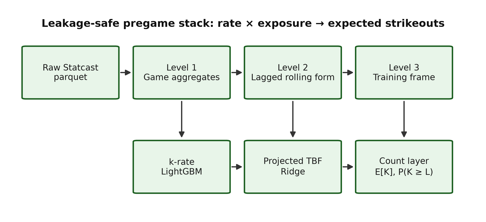
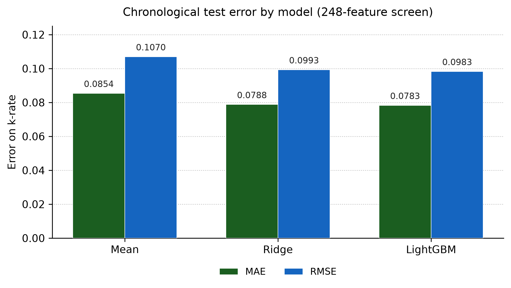
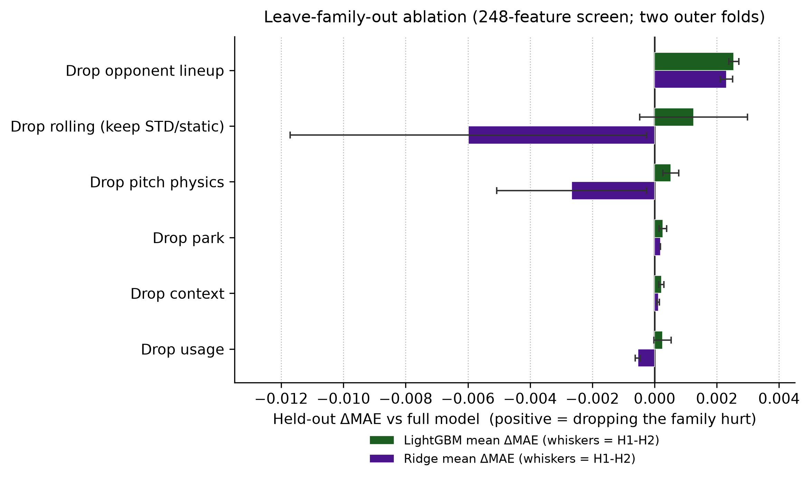
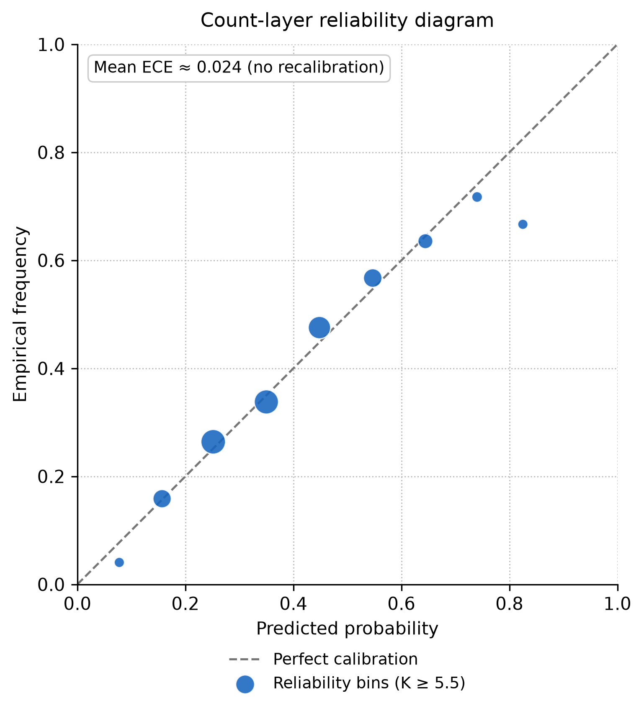

# Leakage-Safe Pregame Pitcher Strikeout Projection from Baseball Savant

**A modeling study of rate estimation, batters-faced exposure, and count probabilities**

Cameron Kaplinger  
Independent Researcher

*Technical manuscript · July 2026*

**Acknowledgments.** Baseball Savant / Statcast pitch-level data provided the empirical foundation for this work.

---

## Abstract

This paper presents a leakage-safe machine learning pipeline for **pregame** starting-pitcher strikeout projection from Baseball Savant (Statcast) pitch-level data. The target is game-level strikeout rate krate = K / PA for pitchers who ultimately face at least nine batters, using only pregame features. A three-level Polars pipeline builds game aggregates, lagged rolling form, and a training frame; nested chronological cross-validation freezes a **180**-feature LightGBM [1] rate model. A companion Ridge [2] model projects batters faced (TBF). Strikeout counts use E[K] = k̂rate × TBF̂ with binomial/Poisson line probabilities [3, 4] on **projected** exposure—never same-game PA. On a 2023–2024 chronological test, frozen rate MAE / RMSE / R² ≈ **0.0787 / 0.0987 / 0.147**—roughly **15%** of game-level rate variance explained. That beats a train-mean floor (MAE ≈ 0.0854) and a Marcel-lite [9] season-talent baseline (MAE ≈ 0.0826) on the same test, while remaining a modest absolute R². Walk-forward expected-K MAE ≈ **1.78**; mean line ECE [5, 6] ≈ **0.024** without recalibration (internal calibration; sportsbooks still out of scope). Leave-family-out ablations report both outer folds: opponent lineup is the only family with a clearly positive ΔMAE on both folds for both models; several other mean deltas hide fold sign flips. The primary contribution is leakage-safe engineering and nested evaluation hygiene around a moderately predictive stack.

---

## 1. Introduction

Strikeout props are a natural target for pregame modeling: the outcome is well-defined, Statcast supplies rich pitch- and PA-level detail, and the quantity of interest separates into a **rate** component and an **exposure** component. Many published baseball analytics workflows emphasize descriptive leaderboards or postgame attribution. Betting-oriented systems often blur the pregame information set. This work treats the problem as **supervised prediction under a strict pregame constraint**.

The modeling claim is simple and compositional. A leakage-safe estimate of strikeout rate, multiplied by a leakage-safe projection of batters faced, yields expected strikeouts and line probabilities without ever using same-game outcomes as inputs:

krate × TBF → E[K] → P(K ≥ L)

**Goal.** Estimate a starter’s strikeout rate before first pitch, project how many batters that starter will face, and convert the pair into expected strikeouts and P(K ≥ L) for common prop lines L.

**Non-goals.** Closing-line validation, de-vig / Kelly staking, and in-game (live) betting. Those are product layers; this manuscript is a **modeling** paper.

**Estimand.** Research metrics are conditional on first pitchers who ultimately face PA ≥ 9 (one turn through the order). Roughly **3.5%** of first-pitcher appearances in 2023–2024 fall below that cutoff (openers, early hooks, injuries). Claims do **not** extend to “every announced starter” until pregame role labels exist.

<figure>

<figcaption><strong>Figure 1.</strong> Leakage-safe architecture. Raw Statcast pitches are aggregated into game records (Level 1), lagged rolling form (Level 2), and a model-ready training frame (Level 3). A LightGBM strikeout-rate model and a Ridge projected-TBF model combine in a count layer that yields expected strikeouts and line probabilities from projected exposure only.</figcaption>
</figure>

### 1.1 Related work

**Sabermetric rate-based pitching models.** Fielding Independent Pitching (FIP) and related estimators such as xFIP summarize pitcher skill from strikeouts, walks, hit batsmen, and home runs (or home-run rates normalized by fly-ball environment), reducing dependence on balls in play and defensive context [7, 8]. Those metrics are primarily descriptive or talent-estimation tools at the season or large-sample level. The present work is complementary: it retains FIP/xFIP-style components as *candidate features*, but the prediction target is game-level krate under an explicit pregame information constraint, not a restatement of FIP as the forecast.

**Season-level baseball projection systems.** Systems such as Marcel [9], PECOTA [10], Steamer, and ZiPS forecast season (or rest-of-season) player rates from weighted recent performance, regression to the mean, aging, and—depending on the system—comparable-player paths. They are the natural external baselines for *talent* estimation. This manuscript scores a **Marcel-lite** game-level krate baseline (Section 6.1)—prior-season weighted K/PA with league-mean regression, without an age curve—on the same chronological test as the frozen LightGBM model. It does **not** re-implement PECOTA/Steamer/ZiPS or score against sportsbook strikeout lines. Marcel answers “does the stack beat a simple public-style talent floor?”; market competitiveness remains unverified.

**Chronological evaluation and leakage control.** When targets are ordered in time, randomly reshuffled cross-validation overstates accuracy by allowing future information into training folds [11]. Forecasting practice therefore prefers expanding or rolling windows and features that are known at the forecast origin. This paper treats those constraints as hard engineering rules (shifted rolling windows, prior-season park factors, date-disjoint partitions) and verifies them with tests and audits rather than as an after-the-fact caveat.

**Count models for rate × exposure.** Once a mean rate and an exposure (here, projected batters faced) are specified, Poisson or binomial probabilities are standard for count outcomes [3, 4]. Line probabilities use those trials on *projected* exposure only. A beta-binomial dispersion check collapses to the binomial limit under the frozen mean, consistent with a well-specified mean model absorbing extra-binomial variance [4].

---

## 2. Contributions

1. **Leakage-safe feature architecture.** Same-game outcomes never enter predictors; rolling statistics are shifted; park factors use prior seasons only; chronological splits never divide a calendar date across partitions.
2. **Nested selection into a frozen feature set.** Feature-family and window decisions are chosen on inner chronological folds that lie wholly inside each training window, then evaluated on a later held-out period. The production LightGBM feature set is frozen at **180** features.
3. **Dual-model strikeout stack.** Unweighted LightGBM for krate; Ridge for projected TBF; binomial count layer on projected exposure. Predictive power is modest: chronological test R² ≈ **0.147** for rate and **0.162** for TBF.
4. **Process evidence, including negative results.** PA-weighting, linear binomial / beta-binomial rate arms, nested LightGBM hyperparameter search, and several expanded feature families did not clear promotion bars—documented rather than buried.

What this paper does **not** claim: large accuracy lifts, market edge, or statistically resolved feature-family rankings beyond two-fold directional consistency. Ablation ΔMAE values are mostly thousandths on two outer folds. The contributions above are engineering and evaluation discipline around a moderately predictive stack that does clear a Marcel-lite talent floor on chronological test krate.

---

## 3. Data and pipeline

Because the stack multiplies rate by exposure, both quantities must be built from the same leakage-safe information set. The pipeline below is the shared foundation for that claim (Figure 1).

### 3.1 Source

Pitch-level regular-season Statcast via Baseball Savant (local parquet cache, seasons 2015–2026 retained for coverage; **model fitting uses 2023–2024 rows**). Season 2022 supplies prior-only park and league context for 2023 boundaries and does not enter training rows. Postseason files are retained but not used in the strikeout stack documented here.

### 3.2 Three levels

**Table 1.** Three-level pipeline outputs.

| Level | Role | Primary outputs |
|---|---|---|
| 1 · Games | Pitch → starter/batter game aggregates | `pitcher_games`, `batter_games`, `pitch_type_games`, `park_factors` |
| 2 · Rolling | Leakage-safe lagged form + context | `pitcher_rolling`, `batter_rolling` |
| 3 · Training | Join lineup + park into model frame | `pitcher_training`, `batter_training` |

Level 1 is the audit surface: denominators, events, and identities are defined once. Level 2 applies rolling and season-to-date windows with an explicit lag so the game being predicted never contributes to its own features. Level 3 assembles opponent-lineup aggregates and prior-season park factors.

Implementation is Polars-first, with automated tests for feature safety, pipeline stages, and the trainer/splitter. Repository paths and artifact names are collected in Appendix A.

### 3.3 Population filter

Default research rows require PA ≥ 9. This is a **postgame** cohort definition for a **pregame** model: it does not leak feature values, but it conditions every reported metric. Population audits show excluded share ≈ **3.5%** (2023–2024). Cutoffs 8–10 change exclusion by about half a percentage point without a sharp elbow; nine remains the frozen policy.

---

## 4. Leakage methodology

Leakage control is not a preamble to the rate × exposure claim—it is what makes the claim scientifically meaningful. If same-game outcomes contaminate features, both the rate model and the TBF model become postgame reconstructions rather than pregame forecasts.

The following rules are treated as hard constraints:

- Same-game K, PA, Outs, and krate are labels / evaluation fields only.
- Rolling and season-to-date player statistics are shifted by one game or start.
- Season-to-date windows reset at season boundaries.
- Park factors for season Y use only seasons before Y.
- Opponent lineup aggregates use each batter’s **pregame** form; historical membership is the first nine distinct batters by first PA.
- Train / validation / test splits are chronological; a calendar date lies in exactly one partition.
- Unexpected numeric columns are rejected unless they match approved pregame naming rules.

Verification includes notebook spot checks (first start of season, season boundary resets, manual rolling recomputation) and an automated test suite. Process bugs (for example, Rays 2025 Steinbrenner vs Tropicana park blending) were logged with before/after evidence in the research log.

**Evaluation honesty.** Early baselines consulted 2025. That season is retained as historical context only. It is **not** a pristine final holdout for the frozen stack. Development metrics use 2023–2024 chronological partitions and nested folds.

---

## 5. Feature design

With the information set fixed, the next question is which pregame signals belong in the rate model that feeds expected strikeouts. Feature design here is deliberately conservative: candidates must be available before first pitch, and promotion requires nested chronological evidence—not descriptive plausibility alone.

### 5.1 Families (conceptual)

Production features fall into families such as:

- pitcher rates (K%, Whiff%, SwStr%, chase, …) over rolling and season-to-date windows;
- pitch physics / usage / mechanics means;
- FIP / xFIP-style components [7, 8] with leakage-safe league priors;
- expected-contact summaries;
- opponent lineup aggregates;
- park and game context (home/away, …).

Expanded research candidates (P2 arsenal, count-state, BIP/BABIP, arm angle, SIERA, run-expectancy value, additional batter discipline/quality) were built and screened; **none cleared nested promotion** into the frozen LightGBM set.

### 5.2 Stabilization and reliability

Denominator-aware stabilization curves estimate when rates become repeatable enough to justify short windows. These studies inform **window hypotheses**; they do not alone change the production feature set. Promotion requires nested chronological evaluation on held-out periods.

### 5.3 Correlation and VIF

Pearson / Spearman diagnostics and VIF cluster reduction support a separate **Ridge** research feature set of **73** features (after dropping a collinear five-start xFIP window). LightGBM does **not** use VIF as a prune rule: tree models tolerate correlated inputs differently. Dual feature sets—one for trees, one for linear models—are intentional.

### 5.4 Window policy

Default generation retains multiple mean windows (including a last-start mean after midseason work). Nested screens supported thinning overlapping mean windows for physics / usage / mechanics / FIP families (keep three- and five-start means; drop the ten-start mean) and a targeted last-start swap for five physics stems. The frozen production size is **180**, reduced from a prior **185**-feature mean-window thin of an earlier **248**-feature allow-list.

---

## 6. Models

Feature design supplies the inputs; the models convert those inputs into the two factors of the paper’s identity—strikeout rate and projected exposure—and then into count probabilities.

### 6.1 Strikeout rate

**Table 2.** Candidate models for game-level strikeout rate.

| Model | Role |
|---|---|
| Mean baseline | Sanity floor |
| Ridge | Linear regularized baseline |
| **LightGBM (unweighted)** | **Frozen production rate model** |

Figure 2 compares Mean, Ridge, and LightGBM chronological test error on the earlier **248**-feature date-disjoint screen (Appendix B). LightGBM achieves the lowest MAE and RMSE among the three; the frozen production model later locks a thinner **180**-feature LightGBM stack with test MAE / RMSE / R² ≈ **0.0787 / 0.0987 / 0.147**.

<figure>

<figcaption><strong>Figure 2.</strong> Chronological test MAE and RMSE on krate for Mean, Ridge, and LightGBM under the 248-feature date-disjoint screen (Appendix B). Lower is better. The production frozen 180-feature LightGBM model’s test MAE is 0.0787, distinct from the 248-feature screen shown here.</figcaption>
</figure>

Likelihood comparisons on nested 2023–2024 folds showed that PA sample-weighting did not beat unweighted game-level MAE for LightGBM or Ridge. An L2 binomial GLM and a two-stage beta-binomial challenger [3, 4] did not overturn unweighted LightGBM. With the frozen mean model, estimated concentration κ hits the binomial limit. **Decision:** keep unweighted LightGBM as the rate backbone.

**Table 3.** Frozen chronological evaluation for the production LightGBM rate model (2023–2024 fit; test from 2024-08-06).

| Partition | MAE | RMSE | R² |
|---|---:|---:|---:|
| Validation | 0.0764 | 0.0966 | 0.151 |
| Test | **0.0787** | **0.0987** | **0.147** |

**Predictive power.** Test R² ≈ 0.147 means the frozen rate model explains roughly **15%** of game-to-game krate variance; the large majority remains unexplained. On the earlier 248-feature chronological screen (Appendix B), LightGBM reduces MAE from **0.0854** (mean baseline) to **0.0783**—about an **8%** relative MAE improvement. That gap is real and repeatable under the paper’s splits, but it is modest: the stack is a carefully constrained incremental predictor, not a high-R² system.

**External talent baseline (Marcel-lite).** To check whether those gains beat a public-style season projection floor—not only an internal mean—the same chronological test is scored against a Tangotiger-style Marcel [9] K/PA projection: weights **3/2/1** on seasons Y−1…Y−3, **100 PA** of league-mean regression, **no age adjustment** (birthdates are absent from the project identity map), using only prior seasons (no same-season games). Rookies with no history receive the prior-year league mean. Table 3b reports the comparison.

**Table 3b.** Chronological test krate error vs external / naive baselines (test from 2024-08-06; n = 1413).

| Predictor | Test MAE | Test RMSE | Test R² |
|---|---:|---:|---:|
| Train-mean constant | 0.0854 | 0.1070 | −0.001 |
| Prior-season K/PA (regressed) | 0.0830 | 0.1038 | 0.056 |
| Marcel-lite (3/2/1, no age) | 0.0826 | 0.1034 | 0.064 |
| **Frozen LightGBM (180 feat.)** | **0.0787** | **0.0987** | **0.147** |

LightGBM beats Marcel-lite by about **0.0039** MAE (~**5%** relative) and roughly doubles the R². That is a meaningful lift over a season-talent floor, still short of a large accuracy claim—and it does **not** evaluate sportsbook lines. Runner: `Models/Strikeout-Model/Strikeout-EDA/marcel_baseline.py`; artifacts under `artifacts/feature_research/marcel_baseline/`.

A nested LightGBM hyperparameter search likewise did not beat freeze defaults on the held-out evaluation periods. That result is interpreted as verification that the defaults already sit near a local optimum, not as a failure of the search protocol.

### 6.2 Projected batters faced (TBF)

Rate alone is not a strikeout count. The second factor is projected batters faced: same-game PA is used only as a historical exposure oracle for training and evaluation, never as a predictor. Predictors include rest, lagged PA / Outs / Pitches, home/park/lineup K context, and thin team bullpen L1–L3d pitch/pitcher-use lookbacks (**24** features).

**Table 4.** Projected-TBF contenders on chronological test (MAE primary).

| Contender | Test MAE | Test RMSE | R² |
|---|---:|---:|---:|
| **Ridge + thin bullpen** | **2.490** | **3.279** | **0.162** |
| Ridge + context only | 2.494 | 3.279 | 0.162 |
| Rich bullpen / Poisson / Elastic Net / LightGBM | ≥ 2.49 | — | ≤ 0.16 |

**Frozen choice:** Ridge with the thin bullpen feature set (coefficients persisted for reproducible scoring). Moderate R² reflects high starter-PA noise (SD ≈ 3.6), not an empty feature set.

### 6.3 Count layer

The count layer is where rate and exposure become the paper’s target quantities, following the standard mean × exposure construction for count probabilities [3, 4]:

Ê[K] = k̂rate × TBF̂ P(K ≥ L) via Binomial / Poisson with n = round(TBF̂)

Same-game PA never enters prop probabilities.

**Table 5.** Expected strikeouts vs actual K on chronological test (from 2024-08-06), by exposure choice.

| Exposure | MAE | RMSE | R² |
|---|---:|---:|---:|
| **Projected TBF** | **1.790** | **2.213** | **0.168** |
| Lagged 5-start mean PA | 1.802 | 2.229 | 0.156 |
| Train-mean PA | 1.822 | 2.252 | 0.138 |

Projected TBF beats simple exposure baselines. Line Brier scores on the test partition are roughly **0.12–0.22** depending on line (3.5–7.5). Beta-binomial dispersion again collapses to the binomial limit under the frozen mean [4].

---

## 7. Ablations and feature-set freeze

The preceding sections define a candidate stack. Ablation evidence then asks which feature families move held-out rate error for the model that enters E[K] = k̂rate × TBF̂, and which cuts can be made without harming that error—subject to the thin two-fold design in Section 7.1.

### 7.1 Protocol

Held-out evaluation periods are 2024 H1 after training on 2023, and 2024 H2 after training through 2024 H1—**two outer chronological folds**. Inner chronological folds lie wholly inside each training window. Selection minimizes mean inner MAE; the later period is used only for evaluation. Automated tests enforce containment and date disjointness. The design does **not** produce confidence intervals or formal significance tests for leave-family-out ΔMAE; with two outer periods, sampling variability is not separately estimated.

### 7.2 Leave-family-out (248-feature screen)

Held-out ΔMAE vs the full model (positive = dropping the family **hurt**) is shown per outer fold and as a two-fold mean in Table 6 and Figure 3. Fold labels: **H1** = 2024 H1 after 2023 training; **H2** = 2024 H2 after training through 2024 H1.

**Table 6.** Leave-family-out ablation (248-feature screen): ΔMAE by outer fold.

| Configuration | LGBM H1 | LGBM H2 | LGBM mean | Ridge H1 | Ridge H2 | Ridge mean |
|---|---:|---:|---:|---:|---:|---:|
| Drop opponent lineup | +0.00238 | +0.00270 | **+0.00254** | +0.00212 | +0.00250 | **+0.00231** |
| Drop rolling (keep STD/static) | +0.00298 | −0.00048 | +0.00125 | −0.01171 | −0.00025 | **−0.00598** |
| Drop pitch physics | +0.00078 | +0.00026 | +0.00052 | −0.00508 | −0.00026 | −0.00267 |
| Drop park | +0.00015 | +0.00038 | +0.00027 | +0.00018 | +0.00019 | +0.00018 |
| Drop context | +0.00030 | +0.00014 | +0.00022 | +0.00008 | +0.00015 | +0.00012 |
| Drop usage | +0.00053 | −0.00002 | +0.00025 | −0.00045 | −0.00062 | −0.00054 |

<figure>

<figcaption><strong>Figure 3.</strong> Leave-family-out mean ΔMAE for LightGBM and Ridge with whiskers spanning the two outer folds (H1–H2). Positive values indicate that removing the family increased held-out error. Wide whiskers (especially Ridge rolling / physics) show that the two-fold mean alone can mislead. Table 6 remains authoritative.</figcaption>
</figure>

**Interpretation.** Magnitudes remain small relative to rate MAE (~0.08). **Opponent lineup** is the only family here with a clearly positive ΔMAE on **both** folds for **both** models—that is why it is retained, still as a directional two-fold observation rather than a formal significance claim. **LightGBM rolling** is *not* both-fold consistent: dropping rolling hurts H1 (+0.003) but slightly helps H2 (−0.0005); the positive mean (+0.00125) hides a sign flip. **Ridge** improves when overlapping rolling windows are removed on both folds (large H1 effect), which is why the linear companion stays on the thinner VIF-reduced set. Park / context / usage deltas are tiny and sometimes cross zero across folds. The keep/drop story is therefore: lineup stays; everything else is too small or too fold-unstable to narrate as a resolved finding.

### 7.3 Keep/drop on the thinned 185-feature set

After mean-window thinning, a greedy family prune with a strict rule—MAE must improve on **both** held-out periods—dropped **zero** families. A chronological comparison of the “pruned” variant against the 185-feature set was identical. Further surgery on that set was noise-scale under the same two-fold design.

### 7.4 Feature-set timeline

The production path compressed an earlier **248**-feature allow-list to a **185**-feature mean-window thin, then to the current **180**-feature set via a five-stem last-start physics swap. Comparing that last-start swap against the 185-feature predecessor showed small rate and expected-K improvements (k-rate MAE ≈ 0.07842 vs 0.07863; expected-K MAE ≈ 1.769 vs 1.773). The freeze encodes that decision; the deltas are below any threshold that would justify calling them a material lift. Named feature-set aliases used in the repository are listed in Appendix A.

**Table 7.** Feature-set timeline (sizes and roles).

| Feature set (description) | Size | Role |
|---|---:|---|
| Pre-thin allow-list | 248 | Comparison baseline |
| Mean-window thin | 185 | Intermediate freeze |
| **Production (current)** | **180** | **Current** (185 + five-stem last-start physics swap) |
| Ridge VIF companion | 73 | Linear-model research set |

---

## 8. Full-stack evaluation

Component metrics are necessary but incomplete. Once rate and TBF are frozen, the object that must be judged is the full composition that the paper claims to deliver:

krate × TBF → E[K] → P(K ≥ L)

**Table 8.** Full-stack evaluation gates and results.

| Evaluation gate | Result |
|---|---|
| Estimator tuning | Keep baseline LightGBM defaults; Ridge α tuned and persisted |
| Walk-forward stack backtest | Mean expected-K MAE ≈ **1.778** across three expanding 2024 windows (σ ≈ 0.036; chronological reference ≈ 1.79) |
| Calibration | Mean ECE ≈ **0.024**; no recalibration applied |
| Population policy | Interim PA ≥ 9 policy; ~3.5% excluded; role labels still open |

Calibration is summarized by expected calibration error (ECE) [5, 6]. Figure 4 shows a reliability diagram for the count-layer probabilities: empirical event frequency versus predicted probability. Mean ECE ≈ **0.024** without recalibration: under chronological evaluation the stack is **internally** well calibrated. Rate-model error clears a Marcel-lite talent floor (Table 3b); count-layer probabilities are still **not** scored against sportsbook closing lines or vig-adjusted implied probabilities.

<figure>

<figcaption><strong>Figure 4.</strong> Reliability diagram for count-layer line probabilities. Points near the diagonal indicate well-calibrated bins; the manuscript reports mean ECE ≈ 0.024 with no post-hoc recalibration. Calibration is internal to the chronological test; it is not a market benchmark.</figcaption>
</figure>

These checks are **confirmatory** relative to the frozen stack’s own objectives: they did not uncover large unused gains on the internal metrics. Market edge remains an open evaluation question.

---

## 9. Limitations

**Population and estimand.** Reported metrics describe conventional-length starts (PA ≥ 9), not all announced starters. Roughly **3.5%** of first-pitcher appearances in 2023–2024 fall below that cutoff, so claims do not extend to planned openers or short-workload roles until pregame role labels exist.

**Predictive power.** Rate-model test R² ≈ **0.147** and TBF R² ≈ **0.162** imply that most game-level variance is unexplained. The Mean→LightGBM MAE gap on the 248-feature screen is about **8%** relative—real, not dramatic. Framing the contribution as methodological is accurate only if it is not used to obscure that ceiling.

**Ablation uncertainty.** Leave-family-out ΔMAE values are mostly **0.0002–0.006**, estimated from **two** outer chronological periods. Table 6 now reports both folds: opponent lineup is both-fold positive for LightGBM and Ridge, but LightGBM rolling and several small families flip sign across folds. Mean-only tables would have overstated those effects. Formal confidence intervals across two fold means remain underpowered; the honest read is directional consistency, not significance.

**Park-factor contamination.** Neutral-site and international series are not filtered from team-keyed park factors. Verified special-event games in 2023–2024 (London, Mexico City, Little League Classic, and similar) are on the order of **~10 games** against ~**2,430** regular-season games per year (~**0.2%**). Absorbed into a prior-season venue-rate factor built from thousands of PA, that dilution is small—but it is not zeroed, and relocated parks (e.g., Rays 2025 Steinbrenner vs Tropicana blending, since fixed with an override) show that venue-key bugs can matter more than the sparse special-event share suggests.

**Evaluation risk.** Early baselines consulted 2025, so that season is not a pristine final holdout for the frozen stack; the next honest final test needs genuinely post-freeze games and, preferably, pregame role labels.

**Scope.** Marcel-lite covers the **rate** component only (no age curve; no Steamer/ZiPS/PECOTA re-implementation). This manuscript still does not evaluate probabilities against closing lines; practical edge versus priced markets is unverified. The count layer uses a point TBF forecast only: mixing a count distribution over a TBF distribution, and negative-binomial challengers with log-TBF offsets, remain future work. External context—weather, travel, catcher framing, and umpire effects—is not integrated.

---

## 10. Conclusion

This work delivers a leakage-safe modeling stack for pregame pitcher strikeout projection: a frozen **180**-feature LightGBM rate model, a thin Ridge TBF companion, and a projected-exposure count layer. Chronological test performance is **modest** (rate R² ≈ 0.147; walk-forward expected-K MAE ≈ 1.78; internal ECE ≈ 0.024) but clears a Marcel-lite season-talent floor on krate (test MAE 0.0787 vs 0.0826). Nested screens document negative and small-effect results; with both outer folds reported, opponent lineup is the only leave-family-out family that is clearly positive on both folds for both models, while several mean-positive families flip sign. The resume-relevant claim is leakage discipline and nested chronological hygiene—not that the model is a strong or market-beating predictor. Next modeling steps are pregame role labels, a true post-freeze holdout, and closing-line evaluation if practical value is the goal.

---

## Reproducibility statement

Code for the leakage-safe pipeline, nested selection utilities, trainers, and count layer lives in the accompanying research repository (Python ≥ 3.11; Polars for feature construction; scikit-learn and LightGBM for models; pytest for automated leakage and pipeline checks). Experiments reported here were run on a local Windows workstation with a project-local virtual environment. Primary data are pitch-level Statcast exports accessed via Baseball Savant (commonly retrieved with community tooling such as pybaseball); users should respect Baseball Savant / MLB terms of use for redistribution and commercial use. Generated local artifacts (model binaries, fold CSVs, stabilization curves) are reproducible from the documented runners but are not required to read the manuscript’s tables and figures.

### Data Availability

Statcast data can be retrieved per-user via public tools (e.g., pybaseball) rather than redistributing bulk parquet, which helps sidestep Baseball Savant / MLB terms-of-use concerns around bulk redistribution.

---

## Appendix A. Repository map

Internal repository names, paths, and frozen-artifact identifiers are collected here so the body text can stay narrative. They do not change any metric reported above.

### A.1 Feature-set aliases

**Table A1.** Feature-set aliases used in code.

| Alias | Size | Description |
|---|---:|---|
| `pre_freeze_248` | 248 | Pre-thin allow-list (comparison) |
| `step7_185` | 185 | Mean-window thin freeze |
| `production` | 180 | Current LightGBM default (185 + five-stem last-start physics swap) |
| `ridge_vif` | 73 | Ridge research companion |
| `workload_context_bullpen` | 24 | Frozen TBF feature set (thin bullpen) |

### A.2 Frozen model artifacts

**Table A2.** Frozen model artifact stems.

| Role | Artifact stem |
|---|---|
| LightGBM k-rate (production) | `lightgbm_krate_20260728_033241` |
| Ridge TBF (thin bullpen) | `tbf_pa_ridge_workload_context_bullpen_20260728_035607` |

Generated research outputs under `artifacts/` are local/reproducible and typically gitignored; metadata hashes live in the matching model JSON sidecars.

### A.3 Documentation and code map

**Table A3.** Documentation and code map.

| Topic | Location |
|---|---|
| Model card | `docs/model-card.md` |
| Research log | `docs/PAPER_NOTES.md` |
| Feature / pipeline reference | `docs/dev-notes.md` |
| Registry freeze | `docs/step10_p1_registry_freeze.md` |
| Ablation findings | `docs/step3_*`, `step4_*`, `step5_*`, `step8_*`, `step9_*` |
| Marcel-lite rate baseline | `Models/Strikeout-Model/Strikeout-EDA/marcel_baseline.py` |
| TBF / count layer | `docs/tbf_first_model_findings.md`, `docs/count_layer_findings.md` |
| Stack quality gates | `docs/phase11_model_quality_gates.md` |
| Population policy | `docs/phase_d_population_findings.md` |
| Architecture diagrams | `diagrams/` |
| Canonical package | `src/Python/` |
| Feature safety gate | `src/Python/features.py` |
| Rate trainer | `Models/Strikeout-Model/train.py` |
| TBF trainer | `Models/TBF-Model/train.py` |
| Superseded overlapping-date baseline archive | `docs/archive/leaky-baseline-2026-07-23/` |

---

## Appendix B. Chronological baseline (248-feature, date-disjoint)

For context against the frozen 180-feature gate, the earlier 2023–2024-only date-disjoint screen on the 248-feature allow-list reported:

**Table B1.** Chronological test metrics on the 248-feature date-disjoint screen.

| Model | Test MAE | Test RMSE | Test R² |
|---|---:|---:|---:|
| Mean | 0.0854 | 0.1070 | −0.001 |
| Ridge | 0.0788 | 0.0993 | 0.138 |
| LightGBM | 0.0783 | 0.0983 | 0.155 |

An older overlapping-date Mean/Ridge run is retained only as process history (Appendix A.3) and must not be cited as current performance.

---

## References

1. Ke, G., Meng, Q., Finley, T., Wang, T., Chen, W., Ma, W., Ye, Q., and Liu, T.-Y. LightGBM: A highly efficient gradient boosting decision tree. In *Advances in Neural Information Processing Systems (NeurIPS)*, 2017.
2. Hoerl, A. E., and Kennard, R. W. Ridge regression: Biased estimation for nonorthogonal problems. *Technometrics*, 12(1):55–67, 1970.
3. Cameron, A. C., and Trivedi, P. K. *Regression Analysis of Count Data*. Cambridge University Press, 2nd edition, 2013.
4. Hilbe, J. M. *Negative Binomial Regression*. Cambridge University Press, 2nd edition, 2011. (Also discusses overdispersion relative to the Poisson/binomial mean–variance relationship; beta-binomial used here as a related overdispersion check.)
5. Naeini, M. P., Cooper, G. F., and Hauskrecht, M. Obtaining well calibrated probabilities using Bayesian binning. In *Proceedings of the AAAI Conference on Artificial Intelligence*, 2015.
6. Guo, C., Pleiss, G., Sun, Y., and Weinberger, K. Q. On calibration of modern neural networks. In *Proceedings of the 34th International Conference on Machine Learning (ICML)*, 2017.
7. Tango, T. M., Lichtman, M. G., and Dolphin, A. E. *The Book: Playing the Percentages in Baseball*. Potomac Books, 2007. (FIP lineage and defense-independent pitching intuition.)
8. Slowinski, P. xFIP. FanGraphs Library / glossary documentation. URL: https://library.fangraphs.com/pitching/xfip/ (accessed 2026-07-28). (xFIP replaces HR with expected HR via fly-ball rate × league HR/FB.)
9. Tango, T. M. Marcel the Monkey Forecasting System. Tangotiger / Hardball Times documentation of the minimal season projection baseline (weighted recent seasons, regression to the mean, age adjustment). URL: https://www.tangotiger.net/marcel/ (accessed 2026-07-28).
10. Silver, N. Introducing PECOTA. In Huckabay, G., Kahrl, C., Pease, D., et al. (Eds.), *Baseball Prospectus 2003*. Brassey’s, 2003, pp. 507–514.
11. Bergmeir, C., Hyndman, R. J., and Koo, B. A note on the validity of cross-validation for evaluating autoregressive time series prediction. *Computational Statistics & Data Analysis*, 120:70–83, 2018.

---

*End of manuscript.*
