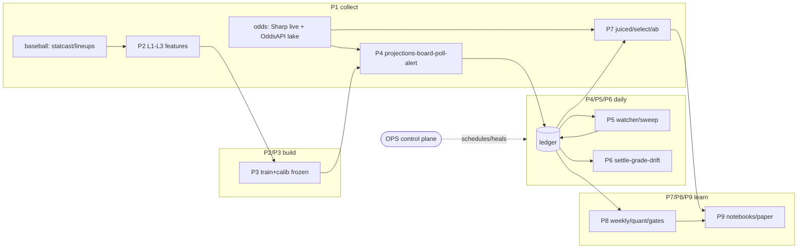

# Canonical Surface Map

This file is the cleanup anchor for "what is canonical vs optional vs archive."

> **Work queue / next actions:** [`docs/EXECUTION_BACKLOG.md`](../EXECUTION_BACKLOG.md) is the master instruction file. This map only classifies surfaces; it does not approve or schedule work.

## Canonical casing policy

- Canonical root naming is lowercase for family references in code/docs:
  - `data/`
  - `models/`
  - `artifacts/`
- Keep all new references lowercase. On Windows, legacy uppercase path aliases
  may still appear in historical notes/tool output; treat lowercase as source of truth.

## Agent / metrics surfaces (not a second queue)

- `docs/reference/opencode_handoff.md` — OpenCode paste contract. Snapshot wins if they disagree.
- `docs/reference/cursor_deep_dive_brief.md` — short pointer at the handoff.
- `docs/reference/golden_metrics.md` — canonical numbers + JSON sources. Cite; do not recompute.
- `docs/reference/oddsapi_replay_architecture.md` — frozen-model 2025-present open/close replay spec (not a queue). Inventory evidence: `docs/reference/reports/oddsapi_replay_inventory_2026-09-11.md`. Measurement: `production/ops/market_research/juiced_replay_ledger.py` (#123). Selection: `production/ops/market_research/select_2025_champion.py` (2025-lock, prereg `docs/reference/reports/policy_reset_2025lock_prereg_2026-09-11.md`). Slate join: `production/ops/market_research/slate_shock_join.py`. Freeze contract: `docs/reference/reports/freeze_playbook_2026-09-11.md`.
- Live policy (champion 2026-09-11): `production/ops/kpi_policy.json` (`edge_cap` 0.24, `under_lean_premium` 0.04, `fill_books` DK/FD, `offset_cap` 0.02) + `line_floor_policy.json`; pin: `tests/test_live_stack_pin.py`.

## Canonical daily surfaces

- **`docs/EXECUTION_BACKLOG.md`** — master work-state / approvals / agent plan (not a runtime script; open first)
- `production/ops/run_daily.py` (morning refresh/score entrypoint)
- `production/ops/live_krate_ensemble.json` (active k-rate blend selection)
- `production/odds/grade_odds_ledger.py` (settle + CLV updates)
- `production/ops/kpi_daily_action.py` (daily model action recommendation)
- `production/ops/policy_simulator.py` (edge-floor policy sweeps)
- `production/notebooks/daily_projections.ipynb` (today board and gate diagnostics)
- `production/notebooks/results_kpi_monitor.ipynb` (10-second health check)
- `production/notebooks/results_calibration_lab.ipynb` (matchup/rest miss pockets)
- `production/notebooks/results_gate_policy.ipynb` (BET/HOLD scenario tuning)
- `production/notebooks/results_pnl_clv.ipynb` (bankroll + CLV progress)

## Deep-dive but non-canonical daily reads

- `production/notebooks/results_dashboard.ipynb` (full deep-dive, archive-level detail)
- `analysis/model_results/model_results_story.ipynb` (narrative summary)

## Keep but do not treat as production

- `playground/` scripts (what-if and manual dry-runs only)
- `docs/archive/` (historical evidence only)
- `analysis/` notebooks (research narrative surface)
- `artifacts/` is protected provenance/generation output; prefer ignore/retention
  policy over ad-hoc deletion.

## Repository sweep context (2026-08-21)

Top-level file counts from a broad documentation inventory pass:

- `artifacts`: 1774
- `models`: 105
- `production`: 96
- `src`: 83
- `data`: 78
- `docs`: 76
- `tests`: 36
- `scripts`: 27
- `playground`: 4
- `analysis`: 2

## Keep/Hold/Delete classification protocol

Apply one status per candidate file:

- `keep`: currently referenced, pipeline-critical, or provenance-critical.
- `hold`: uncertain value, possible future use, or pending owner decision.
- `delete`: proven duplicate/generated/disposable with zero critical references.

Required checks before `delete`:

1. No references in `production/`, `docs/`, `scripts/`, notebooks, or scheduler wrappers.
2. No imports/usages in `src/Python/` or `tests/`.
3. Duplicate claims are verified by hash or byte-equivalence.
4. Morning + settle smoke commands remain runnable.

## Deletion policy for bloat control

Delete only after all checks pass:

1. No references remain in `production/`, `docs/`, or scheduled scripts.
2. No import remains in `src/Python/` or `tests/`.
3. Morning loop + settle loop still run end-to-end.

## Current high-confidence cleanup targets

- Stale notebook outputs and duplicate ad-hoc analysis cells that are now covered by focused notebooks.
- One-off artifacts copied into tracked docs when the canonical source is in `artifacts/`.
- Dated non-protected artifacts via dry-run first:
  - `python scripts/prune_artifacts.py --min-age-days 45`

## Explicit non-targets for deletion

- `src/Python/` modeling and ops modules.
- `production/odds/` and `production/projections/`.
- Frozen model docs under `docs/research/` that are cited by manuscript/reference docs.
- Current `production/notebooks/*.ipynb` set.
- Policy/config surfaces under `production/ops/` (including `kpi_policy.json` and anomaly overrides).

## Pipeline catalog (Phase 10 census 2026-09-17 — design-only, no live changes)

Machine-readable source of truth: `docs/reference/pipeline_registry.json`
(`mlb-props-pipelines-v1`: 9 pipelines, 10 schedules, 6 datasets, 12 gaps,
42 discovery answers). Work sequencing lives only in `docs/EXECUTION_BACKLOG.md`.

| ID | Pipeline | Status | Trigger |
|---|---|---|---|
| P1-INGEST | Collection (baseball + odds arms) | Live (paid pull frozen) | Morning chain + tip windows + manual |
| P2-FEATURES | Transform + L1–L3 | Live | `refresh_features` / live assembly |
| P3-TRAIN | Training + calibration | Frozen-closed | Manual only |
| P4-SERVE | Daily serving + selection | Live | Morning 08:00 + hourly 09–22 |
| P5-CLOSE | Close capture | Live (daemon→cron migration in flight) | Tip windows + q20m sweep + manual |
| P6-SETTLE | Settlement + grading + monitoring | Live | Settle 03:00 + drift 05:30 |
| P7-REPLAY | Replay + policy simulation | Research-on-live-code | Manual |
| P8-EVAL | Evaluation + promotion gates | Live-fragmented → unify (October) | Weekly / manual |
| P9-PUBLISH | Notebooks + publication | Live (thin-client migration queued) | Manual |
| OPS | Control plane (schedules, healers, probes, backfills) | Live | Cron / scheduler / manual |

Shared-vs-prop rule: plumbing (`odds_ledger`, `market.py`, poll/grade/watcher mechanics,
schedulers, ntfy) reuses unchanged; floors/books/closes/dedupe-keys configure;
target/aliases/lines/settlement/domain-features/model/slices go through a prop
adapter (outs before batter; extract only with a second prop proving the contract).
Top gaps: Modal UTC-vs-EDT DST (G-OPS-1), no freshness gate on the board (G-OBS-1),
5 unguarded test invariants (probation→lean order, double-settle, close denominator,
training PIT, live poll book-universe).
